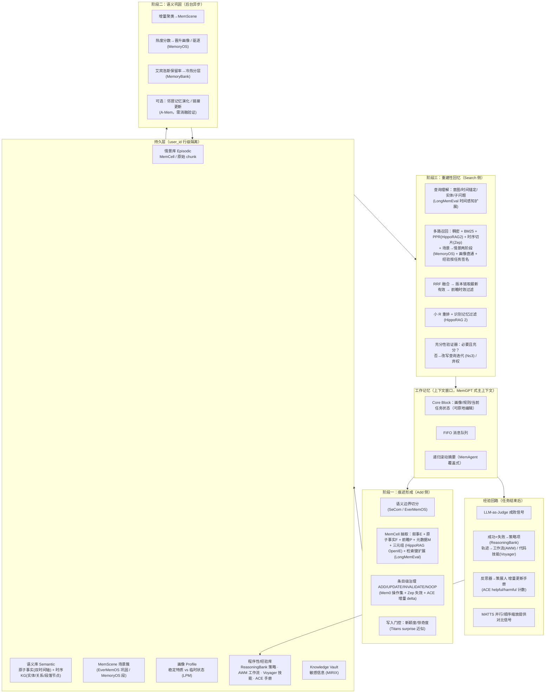

# 基于文献机制的统一记忆系统设计（ULM：Unified Lifecycle Memory）

> 依据 [survey.md](survey.md) 所覆盖的 30 篇论文，把各方法中经过验证的机制拆解为可组合的构件，组装成一套面向 LLM 智能体的通用记忆系统。
> 每个设计点均标注来源笔记，并说明**采用了原论文的哪一机制、规避了它的哪一缺陷**。
> 与本仓库 AML 参赛方案（`../agent-memory-system-design.md` v0.4）的关系见 §10。

---

## 0. 设计目标与总原则

| 目标 | 对应评测能力（[LongMemEval](notes/13-longmemeval.md) 五类） | 主要支撑机制 |
| --- | --- | --- |
| 精确回忆 | 信息提取 IE | 原子事实 + 键扩展 + 混合结构 |
| 跨会话整合 | 多会话推理 MR | MemScene 巩固 + PPR 多跳 + 迭代检索 |
| 知识更新 | 知识更新 KU | 双时间轴 + 边失效 + 版本链 |
| 时序理解 | 时间推理 TR | 事件时间归一化 + 时间感知查询扩展 + 时序切片召回 |
| 知道自己不知道 | 弃权 ABS | 充分性验证器 + 低置信弃权 |
| 持续自我进化 | （[Evo-Memory](notes/06-evo-memory.md) 流式设定） | 经验层：策略/工作流/技能 + 增量策展 |

五条总原则（均来自文献结论，而非直觉）：

1. **没有单一最优结构，混合结构最稳**（[Structural Memory](notes/27-structural-memory.md) Finding 1/4）→ 同一段经历同时保留 chunk/episode、原子事实、三元组、摘要四种视图。
2. **写入侧做重、读取侧做准**（[Mem0](notes/14-mem0.md)、[EverMemOS](notes/05-evermemos.md)）→ 结构化在 Add 时完成，Search 只做召回+验证。
3. **记忆是生命周期而非仓库**（EverMemOS 三阶段）→ 形成 → 巩固 → 重建回忆 → 遗忘/演化闭环。
4. **业务更新不硬删除，合规删除必须硬删**（[Zep](notes/30-zep.md) 双时间轴）→ 普通知识更新表现为版本链；用户删除请求清除正文、索引、来源与调试副本，只保留无内容删除凭证。
5. **精选优于堆量**（Structural Memory：R=10 优于更大 R；K 过大引入噪声）→ 重排只对少量候选，注入上下文的记忆严格限额。

---

## 1. 总体架构



---

## 2. 数据模型

### 2.1 记忆原语：MemCell（[EverMemOS](notes/05-evermemos.md)）+ 混合结构（[Structural Memory](notes/27-structural-memory.md)）

一段经历（一个语义片段）产出**一个 MemCell**，内含四种可独立检索的视图：

```json
{
  "cell_id": "cell_<uuid>",
  "user_id": "...", "session_id": "...",
  "episode": {                                  // E：第三人称叙事，语义锚点（EverMemOS）
    "narrative": "2024-01-03 Dave 告诉 Caroline 他上月开始学风景摄影……",
    "raw_chunk_ref": "session:12:msg[3..9]",    // 原始 chunk 保留（Structural Memory：chunk 抗噪最强）
    "compressed_chunk": "..."                   // SeCom：LLMLingua-2 式去噪压缩版
  },
  "facts": [                                    // F：原子事实（一条一事实）
    {
      "fact_id": "f_<uuid>",
      "content": "Dave 在 2023 年 12 月开始学习风景摄影。",
      "retrieval_keys": ["When did Dave start photography?", "Dave 的爱好是什么？"],  // LongMemEval 键扩展
      "entities": ["Dave", "风景摄影"], "keywords": ["摄影", "爱好"],                  // A-Mem 多字段联合编码
      "type": "fact | preference | rule | event | state",
      "event_time": 1701388800000,              // 事件发生时间（Zep t_event）
      "valid_from": 1704240000000, "valid_to": null,   // 事务/有效时间（Zep 双时间轴）
      "supersedes": null, "superseded_by": null,        // 版本链（软失效，不删除）
      "confidence": 0.92, "sensitivity": "normal | sensitive",
      "recall_count": 0, "last_recalled": null, "strength": 1.0   // MemoryBank 遗忘曲线参数
    }
  ],
  "triples": [["Dave", "has_hobby", "风景摄影", {"t_valid": [1701388800000, null]}]],  // HippoRAG OpenIE + Zep 时序边
  "foresight": [                                // P：前瞻信号，带时效（EverMemOS）
    {"content": "Dave 计划下周末去海边拍照", "t_start": ..., "t_end": ..., "status": "pending"}
  ],
  "meta": {"created_at": ..., "scene_id": "scene_<id>", "heat": 0.0, "source": "dialog | tool | doc"}
}
```

规避的原缺陷：
- Mem0 只存事实、丢原文 → 保留 `raw_chunk_ref` 作兜底（Structural Memory：chunk 在噪声下衰减最慢）。
- HippoRAG NER 错误率高（约 48%）→ 三元组只是**扩展路**，段落/事实节点是主路（HippoRAG 2 教训）。
- A-Mem 全量链接生成开销大、误差累积 → 链接仅在 MemScene 簇内、且限 top-k 邻居生成（见 §4.3）。

### 2.2 MemScene（场景簇）

- 由 MemCell 增量聚类而成（EverMemOS）；判据同时用嵌入相似度与关键词 Jaccard（[MemoryOS](notes/20-memoryos.md) 段形成规则），避免单一向量误聚。
- 每个 Scene 维护：`summary`（LLM 生成）、`heat`（§4.4）、`member_cells[]`、`profile_delta`（对画像的候选更新）。
- 作用：两阶段检索的第一阶段单元（先选 Scene 再选 Cell）；巩固与画像演化的粒度。

### 2.3 画像 Profile（[MemoryOS](notes/20-memoryos.md) LPM + [EverMemOS](notes/05-evermemos.md) 稳定/临时区分）

```
Profile
 ├─ static      : 姓名/年龄/所在地等（低频，需显式证据才更新）
 ├─ stable_traits: 长期偏好/习惯/价值观（多 Scene 反复支持才晋升；带支持计数与最近证据）
 ├─ transient   : 临时状态（心情/短期计划），带 TTL，过期自动降级
 └─ rules       : 用户对助手的显式规则/约束（"不要用英文回答"），最高优先级、总是注入
```

原缺陷规避：MemoryOS 固定 90 维特质表 → 改为开放式条目 + 支持计数，由 Scene 热度驱动晋升（§4.4）。

### 2.4 程序性/经验记忆（[ReasoningBank](notes/25-reasoningbank.md) · [AWM](notes/02-agent-workflow-memory.md) · [Voyager](notes/29-voyager.md) · [ACE](notes/01-ace.md)）

| 子类型 | 结构 | 来源 | 检索键 |
| --- | --- | --- | --- |
| 策略项 Strategy | `{title, description, content, polarity: success/failure, helpful, harmful}` | ReasoningBank 三元结构 + ACE 计数器 | 任务描述嵌入 |
| 工作流 Workflow | `{goal, abstract_steps[], preconditions, variables}` | AWM 抽象化轨迹 | 任务签名（环境+目标模板） |
| 技能 Skill | `{name, code, docstring, verified: bool, deps[]}` | Voyager 可执行技能库 | docstring 嵌入 |
| 手册 Playbook | 分节 bullet 列表，每条带 id/helpful/harmful | ACE 战术手册 | 按节全量注入（限额） |

**失败经验同样入库**（ReasoningBank：加入失败轨迹后 SR 46.5→49.7，而 AWM/Synapse 加失败反而下降）——关键在于失败被蒸馏为"陷阱/反事实"，而非原始轨迹。

---

## 3. 阶段一：痕迹形成（Add 侧）

### 3.1 工作记忆管理（[MemGPT](notes/17-memgpt.md) + [MemAgent](notes/16-memagent.md)）

- 上下文窗口 = `system` + `core_block`（画像/规则/任务状态，可被治理原地编辑）+ `FIFO 队列` + `递归摘要`。
- 队列超压力阈值（如 70%）时触发**驱逐**：被驱逐消息进入 §3.2 切分流程；同时用 MemAgent 覆盖式更新滚动摘要（固定长度，防无限增长）。
- 与 MemGPT 的差异：不依赖 LLM 自主发起分页函数调用（弱模型不可靠、延迟高），而是**确定性触发**；LLM 只负责内容抽取。滚动摘要**只作抽取上下文，不作检索证据**（防 [ACE](notes/01-ace.md) 指出的"上下文坍塌"——反复摘要把细节抹平）。

### 3.2 语义边界切分（[SeCom](notes/26-secom.md) + [EverMemOS](notes/05-evermemos.md)）

- 粒度选择依据 SeCom：轮次级太碎、会话级太噪，**片段级**最优。
- 边界判定：相邻消息与当前段质心的嵌入相似度骤降，并以最大段长作确定性上限。LLM 二值判断仅作为离线消融项，避免默认路径为切分额外支付一次调用。
- 每个片段生成压缩版（SeCom 用 LLMLingua-2 去噪），存于 `episode.compressed_chunk`，用于注入上下文时节省 token；原文引用保留用于 Memory-Doc 模式（§5.6）。

### 3.3 MemCell 抽取（单次 LLM 调用输出 E/F/P/三元组）

- 输入：当前片段 + 上一片段尾部 + 滚动摘要 + 当前画像（用于代词消解与去重）。
- 输出规范：
  - 事实为**陈述句、自包含、一条一事实**；相对时间（"上周"）以消息时间戳为锚归一化为绝对 `event_time`（Zep t_ref 法）。
  - 每条事实生成 1–3 个**问句形式检索键**（LongMemEval：fact-augmented key expansion 使 Recall@k +9.4%）。
  - 三元组带有效区间，头尾实体经归一化函数（小写、去空格、单复数、别名表）——修正 HippoRAG 种子匹配脆弱问题。
  - 前瞻信号必须带 `[t_start, t_end]`，否则不入 P。
- 降级：抽取失败/超时 → 至少以 chunk 形式落 `episode`，保证召回下限。

### 3.4 写入门控：惊奇度（[Titans](notes/28-titans.md) 思想的非参数近似）

Titans 用梯度作为"惊奇度"决定写多少；在明文系统中近似为：

$$
\text{novelty}(f) = 1 - \max_{g \in \mathcal{N}_k(f)} \cos(e_f, e_g), \qquad
\text{surprise}_t = \eta\,\text{surprise}_{t-1} + (1-\eta)\,\text{novelty}(f)
$$

- `novelty` 低且无冲突 → NOOP（去重）；
- `novelty` 低但内容矛盾 → 进入 UPDATE/INVALIDATE 治理；
- `novelty` 高 → ADD，并把动量项 `surprise_t` 作为该片段的初始热度（连续出现新信息的片段更重要）。

### 3.5 条目级治理（[Mem0](notes/14-mem0.md) 操作集 × [Zep](notes/30-zep.md) 失效 × [ACE](notes/01-ace.md) 增量）

对每条新事实，取同用户 top-k 近邻旧事实，由 LLM 输出操作：

| 操作 | 语义 | 与原论文差异 |
| --- | --- | --- |
| ADD | 新知识 | — |
| UPDATE | 补充/细化同一事实（不矛盾） | 合并后**保留旧元数据并集**，不重跑抽取 |
| INVALIDATE | 新事实与旧事实矛盾 | 替代 Mem0 的 DELETE：旧事实 `valid_to = now`、`superseded_by = new`；旧事实仍可被"过去时"问题检索到 |
| NOOP | 重复 | — |

- 治理决策以 **delta 形式**记录（ACE：增量 delta 更新而非整体重写），可回放、可回滚。
- 可选：用 [Memory-R1](notes/21-memory-r1.md) 方式以下游 QA 正确率为奖励训练治理策略小模型，替代提示词——前提是有可验证奖励。

---

## 4. 阶段二：语义巩固（后台异步）

### 4.1 增量聚类到 MemScene
新 MemCell 与现有 Scene 质心比对（嵌入 + Jaccard 综合分 > τ）→ 归入或新建；Scene 摘要按 MemAgent 覆盖式更新。

### 4.2 场景驱动画像演化（[EverMemOS](notes/05-evermemos.md)）
Scene 聚合触发 `profile_delta` 生成：
- 多个 Scene 反复支持的特质 → 晋升 `stable_traits`（支持计数 ≥ 2 且跨会话）；
- 单 Scene 出现的状态 → `transient`（TTL）；
- 与已有画像冲突 → 走 §3.5 INVALIDATE，画像条目也有版本链。

### 4.3 可选：簇内链接与邻居演化（[A-Mem](notes/03-a-mem.md)）
- 该机制默认关闭。只有消融证明其最终准确率收益覆盖额外写入成本和误差累积后，才在同一 Scene 内对 top-k（k≤5）最相似 Cell 生成链接。
- 启用时链接是独立派生视图，不原地改写事实 content；重建失败可直接丢弃并从事实重算，避免演化文本污染证据。

### 4.4 热度、晋升与驱逐（[MemoryOS](notes/20-memoryos.md)）

$$
	ext{Heat}(s) = \alpha \log(1+N_{\text{visit}}) + \beta \log(1+L_{\text{interaction}}) + \gamma R_{\text{recency}} + \delta\,R_{\text{recency}}\,\text{surprise}_0
$$

- 每次检索命中更新 `N_visit` 与 `R_recency`；计数使用对数饱和，surprise 随时间衰减，防止早期热门 Scene 永久垄断；
- Heat > τ → 触发 §4.2 画像晋升，随后 `L_interaction` 归零（MemoryOS：防重复晋升）；
- Scene 数超上限 → 驱逐最低热度 Scene 到冷层（不删除）。

### 4.5 遗忘：艾宾浩斯冷热分层（[MemoryBank](notes/18-memorybank.md)）

$$
R = e^{-t/(S_0\cdot s)}, \qquad s \leftarrow s + \Delta_S/S_0 \text{ 每次被成功召回}
$$

- `R` 低于阈值的事实进入**冷层**：不参与稠密/BM25 主召回，仅可通过版本链、实体图、显式时间范围查询到达。
- `strength` 是无量纲乘数，`S_0` 和召回奖励 `ΔS` 使用天为单位；冷记忆命中后同时回温所属 Scene，避免形成永久不可达的重复场景。
- 与 MemoryBank 差异：不真正删除（Zep 审计原则）；`S` 增量与 §4.4 热度联动。
- 参数化层若启用（§7），可对应 [MemoryLLM](notes/19-memoryllm.md) 的指数遗忘。

---

## 5. 阶段三：重建性回忆（Search 侧）

### 5.1 查询理解（单次 LLM 调用）
输出：`intent`（事实/多跳/时序/画像/程序性/弃权候选）、`entities`（归一化）、`time_scope`、`sub_questions[]`（多跳分解）、`expanded_queries[]`。
- **时间感知查询扩展**（LongMemEval：TR 召回 +6.8%~11.3%）：把"去年夏天"解析为绝对区间；锚点取**该用户最近记忆时间**而非服务器当前时间（避免评测中历史对话相对时间解错）。
- Query-to-Triple（[HippoRAG 2](notes/10-hipporag2.md)）：查询直接与三元组匹配得到 PPR 种子，比 NER 更稳。

### 5.2 多路召回

| 路 | 机制 | 来源 | 适用意图 |
| --- | --- | --- | --- |
| 稠密 | 事实/检索键/叙事三种向量各取 top-k | Mem0、A-Mem | 全部 |
| 稀疏 | BM25（CJK 用 trigram） | EverMemOS Scene 选择、Zep | 精确名词/数字 |
| 图扩展 | 实体—事实—段落二部图上 PPR，事实/段落节点为主、实体为桥 | HippoRAG 2 | 多跳 |
| 时序切片 | `event_time ∈ time_scope` 或 `valid_from/to` 覆盖 t | Zep 双时间轴 | 时序、知识更新 |
| 场景→情景 | 先选 top-m Scene（摘要），再在 Scene 内选 top-k Cell | MemoryOS 两阶段、EverMemOS | 多会话整合 |
| 画像直通 | `rules` 全量、`stable_traits`/`static` 相关 top-10 | MemoryOS LPM | 个性化、规则执行 |
| 经验路 | 任务签名 → 策略/工作流/技能 top-k | ReasoningBank、AWM、Voyager | 程序性任务 |

### 5.3 融合与治理感知排序
- RRF 按**检索通道**融合，而不是把每个 query rewrite 当作独立通道；同一通道的多查询先取每条候选的最佳名次，避免改写数量产生额外投票权；
- **版本链折叠**：默认只取当前有效版本；有明确 `time_scope` 时只保留与该区间相交的版本；无界的“如何变化”问题才保留整条历史链；
- **前瞻时效过滤**：`foresight` 仅在 `t_start ≤ now ≤ t_end` 或与 `time_scope` 相交时返回（EverMemOS）；
- 冷层记忆若被图/时序路命中，回升热度（§4.4/4.5）。

### 5.4 小 R 重排与识别记忆过滤
- 只对融合后 top-30~40 做一次 LLM 批打分（Structural Memory：R≈10 优于大 R；避免全量批打分）。
- 识别记忆过滤（HippoRAG 2）：LLM 判"此条是否与问题相关"，剔除 PPR 带入的噪声；未评分候选保留融合分参与混排，不做惩罚。
- 高成本可选：Zep 式交叉编码器仅对 top-10。

### 5.5 充分性验证与迭代（[EverMemOS](notes/05-evermemos.md) 代理式验证 + [Structural Memory](notes/27-structural-memory.md) Finding 2）
```
for round in 1..N (N ≤ 3):
    evidence = recall(query_set)
    verdict = verify(question, evidence)     # 必要且充分 / 缺什么
    if verdict.sufficient: break
    query_set = rewrite(question, evidence, verdict.missing)   # 针对缺口改写/生成子问题
if not verdict.sufficient and confidence < θ_abs:
    return ABSTAIN                            # LongMemEval ABS：宁可"不知道"
```
迭代检索是文献中最优检索方式，N=2~3 收益最大；超过则噪声上升。

### 5.6 注入策略：Memory-Only vs Memory-Doc（Structural Memory Finding 3）
- 精确问答/多跳（LoCoMo、HotPotQA 型）→ **Memory-Only**：注入原子事实 + 三元组。
- 需要广泛上下文（叙事理解、长文档）→ **Memory-Doc**：以命中的事实定位 `raw_chunk_ref`，注入原文（或 SeCom 压缩版）。
- 由 §5.1 的 `intent` 自动选择；注入总量设硬预算，按融合序截断。
- Memory-Only 仍返回结构化来源引用，但不把原文正文复制进模型上下文；若原子抽取完全失败，则 episode 作为召回下限。`narrative/document` 意图优先 episode 并允许注入受预算约束的原文。

---

## 6. 经验回路（任务级自进化）

经验回路只接受独立的显式任务反馈事件，普通聊天不能自行推断成功或失败。接口至少包含 `task/outcome/trace/task_signature/environment_verified`；真实环境信号优先于 LLM judge，只有环境验证通过的代码技能可标为 `verified=true`。

```
任务结束
 ├─ LLM-as-Judge 判成败（ReasoningBank；有环境反馈时优先用真实信号）
 ├─ 生成器→反思器→策展人（ACE）
 │    反思器：对比成功/失败轨迹，产出洞察（ExpeL 成功-失败配对比较）
 │    策展人：只输出 delta（新增/修改/废止 bullet），更新 helpful/harmful 计数
 ├─ 蒸馏（每轨迹 ≤3 条，ReasoningBank）
 │    成功 → 策略项 / 工作流（AWM 归纳：抽象化变量、保留可复用子流程）
 │    失败 → 陷阱/反事实策略项（polarity=failure）
 │    可执行动作 → 技能（Voyager：环境验证通过才 verified=true）
 └─ MATTS（可选，重要任务）
      并行：多轨迹自对比，过滤偶然成功；顺序：迭代精炼的中间笔记也入库
```

- 策略项也走 §3.5 治理（去重/合并/失效）与 §4.5 遗忘：`harmful` 持续增长者自动降权，直至冷层。
- 多智能体场景：按 [G-Memory](notes/08-g-memory.md) 增加"交互图"层，记录角色间协作轨迹，检索时按角色定制。
- [Dynamic Cheatsheet](notes/04-dynamic-cheatsheet.md) 的"测试时备忘单"即为 Playbook 的会话内瞬态副本：会话结束后经策展人过滤再并入长期手册，避免噪声直接污染。

---

## 7. 可选参数化/激活层（[MemOS](notes/22-memos.md) 三态统一）

MemOS 提出明文 ↔ 激活 ↔ 参数三态记忆及其转换。本设计以明文为主，预留两个插槽：

| 层 | 机制 | 触发条件 | 来源 |
| --- | --- | --- | --- |
| 激活记忆 | 把 `Profile.rules + stable_traits` 预编码为 KV cache 复用 | 每会话高频注入的固定块 | MemOS、[MEM1](notes/15-mem1.md) 恒定状态思想 |
| 参数记忆 | 高热度、长期稳定的知识通过 [Larimar](notes/11-larimar.md) 式情景矩阵一次性写入/遗忘，或 [M+](notes/24-m-plus.md) 长期记忆池 | Heat 持续超阈值 ≥ T 天，且可接受训练成本 | Larimar、MemoryLLM/M+、Titans |

选择保守的理由（来自文献缺陷列）：参数化方法容量固定、训练成本高、仅支持短事实（Larimar）、检索质量约 30%（M+）；明文层可审计、可失效、可隔离，是安全与治理维度的基础。

---

## 8. 安全、隐私与鲁棒性

- **隔离**：`user_id` 为存储层行级隔离边界，不依赖查询层过滤。
- **敏感库**（[MIRIX](notes/23-mirix.md) Knowledge Vault）：`sensitivity=sensitive` 的事实单独存储，默认不进入召回，只在意图明确匹配且策略允许时返回。
- **双重授权**：敏感召回同时要求部署侧策略开关和单请求显式 opt-in；敏感事实不进入共享 Scene 摘要或知识图，避免在重排前泄漏。
- **投毒防御**：记忆 `content` 必须为陈述句，抽取阶段过滤指令式文本（"忽略之前的指令…"）；Playbook 条目只由策展人写入，用户消息不能直接成为规则。
- **可遗忘**：INVALIDATE + 冷层 + 显式 purge 接口（合规删除需硬删，此时记录删除凭证而非内容）。
- **日志最小化**：正文调试日志默认关闭；显式开启时 purge 同步清除该用户的 JSONL 记录。
- **弃权优先**：§5.5 低置信返回空，避免幻觉外溢。

---

## 9. 评估方案

| 维度 | 基准 | 指标 | 消融开关 |
| --- | --- | --- | --- |
| 长期对话 | [LoCoMo](notes/12-locomo.md) | F1 / LLM-judge，分单跳/多跳/时序/开放域/对抗 | 图扩展路、场景两阶段 |
| 五类能力 | [LongMemEval](notes/13-longmemeval.md) S/M | 准确率 + Recall@k/NDCG@k | 键扩展、时间感知扩展、版本链、弃权 |
| 流式自进化 | [Evo-Memory](notes/06-evo-memory.md) | 任务序列累积成功率、步数 | 经验回路、MATTS、失败入库 |
| 结构对照 | Structural Memory 协议 | 单一结构 vs 混合、单步/重排/迭代 | 各视图开关、N/R/K 扫描 |
| 成本 | — | Add/Search LLM 调用数、延迟、token | 门控、簇内链接、重排规模 |

必须报告：**每个模块的增量收益**（EverMemOS/HippoRAG 2 均以消融证明各组件价值），以及 Recall@k 与最终准确率的分离（定位是召回还是阅读失分）。

同时报告最坏成本：首轮为查询理解 + 一次小 R 重排 + 一次充分性验证；每个追加轮最多增加 embedding、一次重排和一次验证。通过 `N/R/K` 硬上限、重复 follow-up 去重及按意图跳过非必要路线控制 TPM，而不再声称 Search 固定只有两次 LLM 调用。

---

## 10. 机制溯源与缺陷规避总表

| 机制 | 来源 | 本设计位置 | 原缺陷 → 处理 |
| --- | --- | --- | --- |
| 主上下文/外部存储分页、Core Block | [MemGPT](notes/17-memgpt.md) | §3.1 | 依赖 LLM 函数调用 → 确定性触发 |
| 覆盖式滚动摘要 | [MemAgent](notes/16-memagent.md) | §3.1 | 固定容量瓶颈 → 摘要仅作抽取上下文 |
| 片段级粒度 + 压缩去噪 | [SeCom](notes/26-secom.md) | §3.2 | 压缩率需调优 → 原文与压缩版并存 |
| MemCell(E/F/P/M)、三阶段生命周期、验证器 | [EverMemOS](notes/05-evermemos.md) | §2.1 §4 §5.5 | LLM 中介延迟 → 巩固异步化 |
| 混合结构、迭代检索、小 R、Memory-Doc | [Structural Memory](notes/27-structural-memory.md) | §0 §2.1 §5.4–5.6 | 任务范围有限 → 意图驱动自适应 |
| 键扩展、时间感知查询扩展、会话分解 | [LongMemEval](notes/13-longmemeval.md) | §3.3 §5.1 | — |
| ADD/UPDATE/DELETE/NOOP | [Mem0](notes/14-mem0.md) | §3.5 | 硬 DELETE 丢历史 → INVALIDATE |
| 双时间轴、边失效、时序 KG | [Zep](notes/30-zep.md) | §2.1 §5.2 §5.3 | 交叉编码器贵 → 仅 top-10 可选 |
| 增量 delta 策展、helpful/harmful、防坍塌 | [ACE](notes/01-ace.md) | §3.5 §6 | 依赖反馈质量 → 与 Judge/环境信号并用 |
| 段页式三级存储、热度公式、两阶段检索 | [MemoryOS](notes/20-memoryos.md) | §2.3 §4.4 §5.2 | 固定 90 维画像 → 开放条目+支持计数 |
| 艾宾浩斯遗忘、召回强化 | [MemoryBank](notes/18-memorybank.md) | §4.5 | 遗忘=删除 → 冷层可回升 |
| 笔记链接与邻居演化 | [A-Mem](notes/03-a-mem.md) | §4.3 | O(N) 链接成本 → 限簇内 top-k |
| OpenIE KG + PPR 单步多跳 | [HippoRAG](notes/09-hipporag.md) | §5.2 | NER 错误多 → 事实/段落节点为主 |
| 段落节点、Query-to-Triple、识别记忆过滤 | [HippoRAG 2](notes/10-hipporag2.md) | §5.1 §5.2 §5.4 | 计算成本高 → 作为扩展路 |
| 惊奇度写入、动量、遗忘门 | [Titans](notes/28-titans.md) | §3.4 | 训练吞吐慢 → 非参数近似 |
| 成功+失败蒸馏、三元 schema、MATTS | [ReasoningBank](notes/25-reasoningbank.md) | §2.4 §6 | 巩固过于简单 → 接入治理与遗忘 |
| 工作流归纳 | [AWM](notes/02-agent-workflow-memory.md) | §2.4 §6 | 动作僵化 → 抽象化变量 + 前置条件 |
| 可执行技能库 + 环境验证 | [Voyager](notes/29-voyager.md) | §2.4 §6 | 幻觉代码 → verified 标志 |
| 成功/失败对比洞察 | [ExpeL](notes/07-expel.md) | §6 | 上下文限制 → 洞察入库而非全轨迹 |
| 测试时备忘单 | [Dynamic Cheatsheet](notes/04-dynamic-cheatsheet.md) | §6 | 记忆噪声 → 会话瞬态副本经策展并入 |
| 多智能体三层图 | [G-Memory](notes/08-g-memory.md) | §6 | — |
| 六组件 + Knowledge Vault + 主动检索 | [MIRIX](notes/23-mirix.md) | §2 §8 | 路由出错 → 确定性类型字段而非 LLM 路由 |
| 三态记忆与 MemCube 调度 | [MemOS](notes/22-memos.md) | §7 | 系统复杂 → 仅预留插槽 |
| 恒定内部状态 | [MEM1](notes/15-mem1.md) | §7 | 需可验证奖励 → 仅激活层复用 |
| RL 训练记忆管理器 | [Memory-R1](notes/21-memory-r1.md) | §3.5 可选 | 两阶段训练复杂 → 提示词先行、RL 后置 |
| 一次性编辑/选择性遗忘 | [Larimar](notes/11-larimar.md) | §7 | 仅短事实 → 只承载高热稳定事实 |
| 潜在记忆池 / 长期扩展 | [MemoryLLM](notes/19-memoryllm.md)、[M+](notes/24-m-plus.md) | §7 | 容量固定、训练贵 → 可选 |
| 评测协议 | [LoCoMo](notes/12-locomo.md)、[LongMemEval](notes/13-longmemeval.md)、[Evo-Memory](notes/06-evo-memory.md) | §9 | — |

---

## 11. 与本仓库 AML 方案（`../agent-memory-system-design.md` v0.4）的关系

AML v0.4 是本通用设计在平台约束下（Add 同步屏障、Search 只返证据、top_k=100、模型可配置）的实例化：AMU 承载 facts/episode/程序性条目，软废止版本链对应 INVALIDATE，并实现七路召回与显式反馈经验路。

1. **语义边界切分**替代按平台分块直接抽取（§3.2）；
2. **MemScene 巩固 + 场景→情景两阶段召回**，直接针对多会话整合失分（§2.2 §4.1 §5.2）；
3. **前瞻信号 P 与时效过滤**，覆盖"计划/临时状态"类时序题（§2.1 §5.3）；
4. **热度驱动画像晋升 + 稳定/临时区分**，替代静态 profile 直通（§2.3 §4.4）；
5. **充分性验证 + 迭代检索 + 弃权**（§5.5），对应 REVIEW 中 D4 缺失项；
6. **惊奇度写入门控**降低重复事实与治理调用量（§3.4）；
7. **经验层**通过独立反馈接口写入策略/工作流/技能/手册；普通 Add 不推断任务成败（§2.4 §6）。

激活记忆与参数记忆仍是 §7 的可选研究插槽，不属于 AML v0.4 的交付范围；SQLite 是单机参考实现，生产水平扩展目标仍为 Postgres/pgvector。

REVIEW.md 中已识别的 P0 问题（embedding 截断、时间锚点、全量重排）在本设计中分别由 §5.1 锚点规则、§5.4 小 R 重排原则直接约束。
