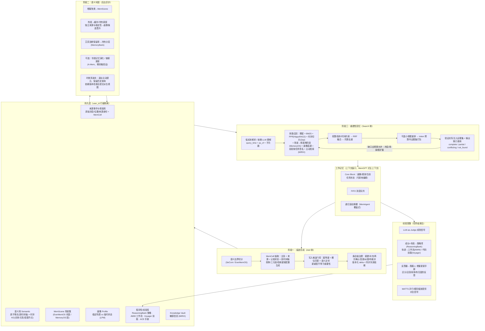

# 基于文献机制的统一记忆系统设计（ULM：Unified Lifecycle Memory）

> 依据 [survey.md](survey.md) 所覆盖的 30 篇论文，将文献机制与本设计提出的工程约束组合为面向 LLM 智能体的通用记忆系统。
> 文献中的实验收益不代表组合后的系统已经验证有效；机制改造、适用边界与待验证假设分别说明，并通过 §9 评估。
> 与本仓库 AML 参赛方案（`../agent-memory-system-design.md` v0.4）的关系见 §11；本文新增约束不代表 AML 已经实现。

---

## 0. 设计目标与总原则

| 目标 | 对应评测能力（[LongMemEval](notes/13-longmemeval.md) 五类） | 主要支撑机制 |
| --- | --- | --- |
| 精确回忆 | 信息提取 IE | 原子事实 + 键扩展 + 混合结构 |
| 跨会话整合 | 多会话推理 MR | MemScene 巩固 + PPR 多跳 + 迭代检索 |
| 知识更新 | 知识更新 KU | 双时间轴 + 边失效 + 版本链 |
| 时序理解 | 时间推理 TR | 事件时间归一化 + 时间感知查询扩展 + 时序切片召回 |
| 知道自己不知道 | 弃权 ABS | 最终证据集验证 + 完整/部分/冲突/未找到状态 |
| 持续自我进化 | （[Evo-Memory](notes/06-evo-memory.md) 流式设定） | 经验层：策略/工作流/技能 + 增量策展 |

总原则（区分文献依据与本设计约束）：

1. **结构选择依赖任务**（[Structural Memory](notes/27-structural-memory.md) Finding 1/4）→ 保留原文与原子主张作为基础，支持 episode、三元组和摘要等派生视图；默认基线不强制生成全部视图。
2. **写入可追溯、读取按需升级**（借鉴 [Mem0](notes/14-mem0.md)、[EverMemOS](notes/05-evermemos.md)，成本路由为本设计假设）→ 先运行原文/事实混合检索，在歧义、冲突或证据缺口出现时启用复杂路线。
3. **记忆是生命周期而非仓库**（EverMemOS 三阶段）→ 形成 → 巩固 → 重建回忆 → 遗忘/演化闭环。
4. **业务更新不硬删除，合规删除必须硬删**（[Zep](notes/30-zep.md) 双时间轴）→ 普通知识更新表现为版本链；用户删除请求清除正文、索引、来源与调试副本，只保留无内容删除凭证。
5. **在预算内保留完整证据**（Structural Memory 的噪声观察 + 本设计约束）→ 以 token 预算、子问题覆盖和支持链完整性选取证据，验证截断与序列化后的实际上下文，不固定要求十条。
6. **派生视图不能创造新证据**（本设计约束）→ 来源、版本与依赖可追踪；同源事实、三元组、摘要只计一次支持，更新/删除沿依赖传播。
7. **热度与知识状态分离**（本设计约束）→ 访问频率用于存储调度，可信度、稳定性和画像晋升依赖证据；冷记忆始终保留通用检索入口。

**文献使用边界**：§10 的“来源”表示机制启发，不表示整套组合、参数或工程保障由原论文证明。`R≈10`、`N=2~3` 等仅作实验起点；非参数 novelty、冷层回退与反馈归因属于待验证改造。双时间轴、检索参数与识别过滤的关键语义另核对 [Zep 原文 §2](https://arxiv.org/html/2501.13956v1)、[Structural Memory 原文 §5.4](https://arxiv.org/html/2412.15266v1) 和 [HippoRAG 2 原文 §3.4/附录 E](https://arxiv.org/html/2502.14802v1)。

---

## 1. 总体架构



---

## 2. 数据模型

### 2.1 记忆原语：MemCell（[EverMemOS](notes/05-evermemos.md)）+ 混合结构（[Structural Memory](notes/27-structural-memory.md)）

一段经历（一个语义片段）产出**一个 MemCell**。原始消息是来源记录，`facts` 是有来源支撑的原子主张，不保证天然为真；叙事、压缩文本、检索键、三元组和摘要均为可重建派生视图。基础模式保留原文与主张，其余视图按配置生成；未生成的视图不得成为默认检索的必要依赖。以下为完整模式示例：

```json
{
  "cell_id": "cell_1",
  "user_id": "user_1", "session_id": "session_12",
  "source_message_ids": ["msg_9"],
  "episode": {
    "narrative": "2024-06-10 Dave 说，他从 6 月 1 日起住在上海。",
    "raw_chunk_ref": "session:12:msg[9]",
    "compressed_chunk": "Dave：6月1日起住在上海。",
    "derived_from": [{"source_id": "msg_9", "version": 1}]
  },
  "facts": [
    {
      "fact_id": "f_1", "version_id": "f_1_v1",
      "content": "Dave 从 2024 年 6 月 1 日起住在上海。",
      "subject_id": "person_dave", "predicate": "primary_residence", "object": "上海",
      "scope": "personal", "cardinality": "single",
      "retrieval_keys": ["Dave 住在哪里？"],
      "entities": ["person_dave", "上海"], "keywords": ["居住地"],
      "type": "state", "epistemic_status": "asserted", "resolution_status": "accepted",
      "source_message_ids": ["msg_9"],
      "source_spans": [{"message_id": "msg_9", "start": 0, "end": 14}],
      "support_event_ids": ["observation_9"], "counter_evidence_ids": [],
      "valid_from": "2024-06-01T00:00:00+08:00", "valid_to": null,
      "valid_from_status": "known", "valid_to_status": "open",
      "recorded_from": "2024-06-10T10:00:00+08:00", "recorded_to": null,
      "time_precision": "day", "time_basis": "explicit_message",
      "supersedes": null, "superseded_by": null,
      "confidence": null, "sensitivity": "normal",
      "recall_count": 0, "used_count": 0, "last_used": null, "strength": 1.0
    }
  ],
  "triples": [
    {"head": "person_dave", "relation": "primary_residence", "tail": "上海",
     "derived_from": [{"fact_id": "f_1", "version_id": "f_1_v1"}]}
  ],
  "foresight": [],
  "meta": {"scene_id": null, "heat": 0.0, "source": "dialog", "scope_epoch": 1}
}
```

字段语义与约束：

- **双时间轴**：`valid_from/to` 表示主张在现实世界成立的区间；`recorded_from/to` 表示系统在何时持有该版本，采用左闭右开区间。`recorded_to=null` 仅表示当前认知版本，不代表事实现在仍有效。版本链保留修订关系，不能替代任一时间轴。
- **时间精度**：只有月份/年份时保留时间区间与 `time_precision`，不得伪造精确日期；事件可增加 `event_time_range`，与状态有效期分开。每个有效期边界用 `known/open/unknown` 状态区分已知时间、当前尚未结束与信息缺失，不能只用 `null` 同时表达后两者；查询返回时间不确定性。`open` 也不保证将来永远有效。
- **认知状态**：`epistemic_status` 为 `asserted`（主体明说）、`observed`（工具观察）、`inferred`（模型推断）或 `planned`（未实现计划）；`resolution_status` 为 `accepted/disputed/retracted`。接受存储不等于已证实，模型推断不得因访问或摘要复述自动晋升。
- **来源身份**：原始消息记录 `speaker_id/role/source_kind/trust_scope`；`source_spans` 为该消息原文的 Unicode 码点左闭右开位置。原文和身份由摄入层保存，LLM 不能创造来源身份或权限。
- **独立支持**：`support_event_ids` 标识原始观察事件；同一事件的导入重试、摘要、三元组和跨会话转述不增加独立支持。新的直接确认可增加观察事件，无法判断是否独立时保守去重。重复支持不自动等于多个独立信息源。
- **前瞻条目**：统一使用 `epistemic_status=planned/inferred`，另带 `t_start/t_end`、`status=pending/expired/done/cancelled`、来源和版本。缺少时间范围时保留为未定时计划，不启用临期提醒；过期不代表完成。
- **置信度**：仅保存有方法版本与校准依据的估计；未校准时为 `null`。新颖度、访问热度、支持数和模型自报信心不能互相替代。

规避的原缺陷：
- Mem0 只存事实、丢原文 → 保留 `raw_chunk_ref` 作兜底（Structural Memory：chunk 在噪声下衰减最慢）。
- HippoRAG 的实体匹配与抽取误差 → 三元组只是**扩展路**，段落/事实节点是主路；错误分析样本中的比例不作为全局错误率。
- A-Mem 全量链接生成开销大、误差累积 → 链接仅在 MemScene 簇内、且限 top-k 邻居生成（见 §4.3）。

### 2.2 MemScene（场景簇）

- 由 MemCell 增量聚类而成（EverMemOS）；判据同时用嵌入相似度与关键词 Jaccard（[MemoryOS](notes/20-memoryos.md) 段形成规则），避免单一向量误聚。
- 每个 Scene 维护：`summary`（LLM 生成）、`heat`（§4.4）、`member_cells[]`、`profile_delta`（对画像的候选更新）、`derived_from`、`built_at_revision`、`view_status=ready/stale/building`。摘要中的主张关联来源版本；Scene 数量不充当独立支持数量。
- 作用：两阶段检索的第一阶段单元（先选 Scene 再选 Cell）；巩固与画像演化的粒度。

### 2.3 画像 Profile（[MemoryOS](notes/20-memoryos.md) LPM + [EverMemOS](notes/05-evermemos.md) 稳定/临时区分）

```
Profile
 ├─ static      : 姓名/年龄/所在地等（低频，需显式证据才更新）
 ├─ stable_traits: 长期偏好/习惯/价值观（去重后的原始证据跨时间支持；保留反例与认知状态）
 ├─ transient   : 临时状态（心情/短期计划），带 TTL，过期自动降级
 └─ rules       : 经来源确认的显式用户偏好/约束，按作用域、有效期和当前请求选择
```

原缺陷规避：MemoryOS 固定 90 维特质表 → 开放式条目 + 去重支持/反例集合。画像晋升依据 §4.2 的证据条件；热度只调度处理优先级，不决定是否晋升。

`rules` 另带 `scope/authority/source_message_ids/valid_from/valid_to/revoked_at`。只能由经过身份确认的明确用户指示进入规则治理；转述、引用、文档或工具输出不能自行获得用户授权。历史偏好服从平台指令层级与当前用户指示；应用层先确定适用规则并预留预算，冲突或预算不足必须显式处理，不得静默截断关键约束。

### 2.4 程序性/经验记忆（[ReasoningBank](notes/25-reasoningbank.md) · [AWM](notes/02-agent-workflow-memory.md) · [Voyager](notes/29-voyager.md) · [ACE](notes/01-ace.md)）

| 子类型 | 结构 | 来源 | 检索键 |
| --- | --- | --- | --- |
| 策略项 Strategy | `{title, description, content, polarity, applicability, failure_conditions, support_ids, counterexample_ids, validation_status, helpful, harmful}` | ReasoningBank 三元结构 + ACE 计数器；适用性/归因为本设计扩展 | 任务描述 + 环境/条件 |
| 工作流 Workflow | `{goal, abstract_steps[], preconditions, variables}` | AWM 抽象化轨迹 | 任务签名（环境+目标模板） |
| 技能 Skill | `{name, code_version, code, docstring, deps[], verification: {status, environment_fingerprint, dependency_versions, test_ids, verified_at}}` | Voyager 环境验证 + 本设计版本约束 | docstring + 环境兼容性 |
| 手册 Playbook | 分节 bullet 列表，每条带 id/来源/适用条件/反馈事件集合 | ACE 战术手册 | 按任务选取，统一预算内注入 |

**失败经验同样入库**（ReasoningBank：加入失败轨迹后 SR 46.5→49.7，而 AWM/Synapse 加失败反而下降）——关键在于失败被蒸馏为"陷阱/反事实"，而非原始轨迹。

上述收益限于论文设置。失败轨迹证明“发生过失败”，不证明反事实策略一定有效；新策略以 `validation_status=hypothesis` 入库，验证后才标记 `validated`。技能验证只对记录的代码、环境和依赖版本有效（§6）。

### 2.5 来源、派生依赖与一致性契约（本设计约束）

1. **来源与主张分层**：原始事件保留内容、身份、消息时间、摄入时间和幂等键；除显式 purge 外不覆盖原文。主张修订以版本/delta 记录。叙事、图、摘要、画像、压缩文本、检索键与缓存都保存 `derived_from`，不能把自身输出当成新来源。
2. **同步可见性**：Add 成功须完成原文、主张/抽取降级状态、版本变更及依赖失效标记的持久化，返回 `write_revision`。派生视图可异步构建；Search 可指定 `min_revision`，索引未追上时检索已提交增量或明确返回未就绪，不能静默漏掉刚写入内容。
3. **更新传播**：修改或撤回来源/主张时，同步使相关依赖不可作为当前证据使用，再异步重建。图遍历不得通过不合版本的边；历史视图仅在依赖与指定 `as_of` 相容时可用。过时 Scene 不得阻断直接来源检索。
4. **后台提交检查**：任务携带来源版本和作用域 `scope_epoch`；提交时在事务内重新校验，版本不符则丢弃并重建。purge 提升 epoch 并删除依赖，迟到任务不能复活内容；删除凭证不保留被删正文。
5. **一致读取**：一次 Search 使用明确 `read_revision`，所有候选、过滤和证据验证基于相容版本；返回前检查删除/撤权是否发生，发生则重打包并重新验证或终止。原文兜底同样受权限与主张修订标记约束，不能绕过纠错。

---

## 3. 阶段一：痕迹形成（Add 侧）

### 3.1 工作记忆管理（[MemGPT](notes/17-memgpt.md) + [MemAgent](notes/16-memagent.md)）

- 上下文窗口 = `system` + `core_block`（画像/规则/任务状态，可被治理原地编辑）+ `FIFO 队列` + `递归摘要`。
- 原始消息到达时先按幂等键持久化；队列超压力阈值（如 70%）、会话结束、显式 Add 屏障或达到最大等待时间时，确定性 flush 未处理片段至 §3.2。队列驱逐前确认来源已保存，避免短会话一直未达阈值而没有长期记忆。
- 驱逐时可用 MemAgent 思想更新固定长度滚动摘要；摘要是派生上下文，带来源版本并单独计费，不覆盖原始消息。
- 与 MemGPT 的差异：分页与持久化由**确定性逻辑触发**，LLM 参与抽取、摘要等内容处理。滚动摘要**只作抽取上下文，不作检索证据**（防 [ACE](notes/01-ace.md) 指出的"上下文坍塌"——反复摘要把细节抹平）。

### 3.2 语义边界切分（[SeCom](notes/26-secom.md) + [EverMemOS](notes/05-evermemos.md)）

- 依据 SeCom 将片段级作为初始粒度，并与轮次级/会话级对照；不假定该粒度在所有领域最优。
- 边界判定：相邻消息与当前段质心的嵌入相似度骤降，并以最大段长作确定性上限。LLM 二值判断仅作为离线消融项，避免默认路径为切分额外支付一次调用。
- 按配置生成压缩版（SeCom 用 LLMLingua-2 去噪），存于 `episode.compressed_chunk`，保留来源位置与版本；压缩模型计算纳入成本。原文用于 Memory-Doc 模式（§5.6）。

### 3.3 MemCell 抽取（每个有界片段一次 LLM 调用）

- 输入：当前片段 + 上一片段尾部 + 滚动摘要 + 当前画像（辅助部分均带来源，且只用于代词消解与去重）。新支持事件只能来自当前新增原始观察，不能来自辅助摘要/画像的重复陈述。
- 输出规范：
  - 主张为**自包含、一条一事实**，带原文位置、身份、认知状态和时间依据；陈述句只是格式要求，不是安全边界。
  - 相对时间（"上周"）以原消息时间与时区为锚，输出事件区间或状态有效期；摄入时间仅由存储层写入 `recorded_from`。模糊日期保留精度，缺少锚点时返回未知。
  - 每条事实生成 1–3 个**问句形式检索键**（LongMemEval：fact-augmented key expansion 使 Recall@k +9.4%）。
  - 三元组在启用图视图时生成，并引用主张版本，继承其时间、权限与认知状态。实体使用规范 ID 和别名表；字符串归一化只产生匹配候选，不据此直接合并不同人物。
  - 前瞻有时间范围才启用定时提醒；未定时计划仍保留来源与 `planned` 状态。
- 降级：抽取失败/超时 → 至少以 chunk 形式落 `episode`，保证召回下限。
- 来源跨度、时间区间、枚举与引用由确定性校验器检查；不合法输出不得触发旧知识失效。输入/输出分别设 token 上限，大段先拆分；重试有硬上限，不能以“一次调用”掩盖多片段处理量。

### 3.4 写入门控：幂等、再次确认与新颖度

先用消息/导入幂等键识别重试，再以主张槽位（主体、属性、作用域）与 top-k 语义近邻寻找治理候选。受 [Titans](notes/28-titans.md) 启发，可记录下列非参数新颖度特征；它不等价于原论文的梯度惊奇度，其收益必须消融验证：

$$
\text{novelty}(f) = 1 - \max_{g \in \mathcal{N}_k(f)} \cos(e_f, e_g), \qquad
\text{surprise}_t = \eta\,\text{surprise}_{t-1} + (1-\eta)\,\text{novelty}(f)
$$

- 无近邻时将 novelty 标为新候选；余弦值只作特征，不解释成概率。动量按用户/主题维护并记录更新时间，避免跨用户或无关主题串扰。
- 相同来源事件的重试、重复抽取或转述 → NOOP，不增加支持计数。
- 语义重复但来自新的直接确认 → UPDATE 的 `reaffirm` 子类，保留原内容并追加去重后的观察事件和时间；不能把新确认当作无价值重复丢弃。
- 可能矛盾 → 进入 §3.5，语义距离不能判定是否冲突。槽位检索独立于向量 top-k，避免相似主张太多而漏掉必须检查的当前状态。
- 高 novelty → 候选 ADD，仍须通过来源、权限和抽取有效性检查；不直接增加画像可信度或决定长期保留价值。
- 同一主张的近邻结果供门控与治理复用；多个主张分别产生候选，可批量查询，但不声称整个 Add 只做一次 top-k 查询。

### 3.5 条目级治理（[Mem0](notes/14-mem0.md) 操作集 × [Zep](notes/30-zep.md) 失效 × [ACE](notes/01-ace.md) 增量）

对新主张复用 §3.4 的槽位/近邻候选。先检查同一主体、属性、作用域、属性是否允许多值、有效区间是否重叠及来源是否可裁决，再由确定性规则或 LLM 提议操作；提交由事务层验证并执行。多值爱好不同不构成冲突，未知时间不强行判定覆盖，最新摄入也不自动代表最可信。

| 操作 | 语义 | 提交约束 |
| --- | --- | --- |
| ADD | 新主张，或不互斥的补充事实 | 保存来源与认知状态；不静默覆盖邻居 |
| UPDATE | `enrich` 补充/细化，或 `reaffirm` 新观察再次确认 | 新建版本并保留来源集合；时间、权限、敏感级别不能盲目取元数据并集 |
| INVALIDATE | 已确认的 `world_change/correction/retraction` | 按下述时间规则版本化；同步失效派生依赖，保留历史认知 |
| DISPUTE | 来源或时间不足以裁决的互斥主张 | 保留双方及冲突组，返回 conflicting，不任意选最新一条 |
| NOOP | 同一事件的重复处理 | 幂等返回，不增加独立支持或热度 |

- **世界变化**：6 月 10 日获知 6 月 1 日搬家，新的居住状态从 6 月 1 日有效。事务层在 6 月 10 日关闭旧认知行的 `recorded_to`，追加“旧居住状态截至 6 月 1 日”的修订行及新状态；旧认知行原有有效期不原地改写。因此按 6 月 5 日的 `as_of` 仍能还原当时认知。
- **追溯纠错/撤回**：“之前说错了”不表示现实在今天变化；关闭被纠正认知版本的记录区间，追加修正版本或撤回记录，并标注修正所覆盖的历史区间。边界未知则保留不确定性，不使用 `now` 伪造现实变化时间。
- 治理 delta 包含 `operation_id/expected_version/reason/source_ids`，可幂等回放；并发修改冲突则重新读取和裁决。回滚是追加修订，不抹除审计记录，也不能恢复被 purge 的内容。
- 可选：用 [Memory-R1](notes/21-memory-r1.md) 方式以下游 QA 正确率为奖励训练治理策略小模型，替代提示词——前提是有可验证奖励。

---

## 4. 阶段二：语义巩固（后台异步）

### 4.1 增量聚类到 MemScene
新 MemCell 与现有 Scene 质心比对（嵌入 + Jaccard 综合分 > τ）→ 归入或新建。Scene 摘要可增量更新，但输入须能追溯到成员主张/原文；不能仅靠上一版摘要递归改写。成员纠错、删除或摘要漂移时从有效来源重建，输出按 §2.5 检查依赖版本后提交。

### 4.2 场景驱动画像演化（[EverMemOS](notes/05-evermemos.md)）
Scene 聚合只触发 `profile_delta` 候选，不直接授权晋升：
- 明确用户偏好保留为 `asserted`；推断特质须有去重后的原始支持事件、跨时间一致性和反例检查，才可成为 `stable_traits` 候选。最少支持数与时间跨度由开发集标定，跨两个 Scene/会话本身不足以证明稳定。
- 相同来源的事实、图、摘要、画像反馈只能计一次；再次确认记录独立观察，但不自动提高来源可信级别。推断画像保留 `inferred` 标记。
- 明确短期状态 → `transient`（TTL）；不能仅凭“只出现一个 Scene”判断它短期有效。
- 与已有画像冲突 → §3.5 判定变更、纠错或待裁决；画像也保存版本与依赖。热度不参与真实性判断。

### 4.3 可选：簇内链接与邻居演化（[A-Mem](notes/03-a-mem.md)）
- 该机制默认关闭。只有消融证明其最终准确率收益覆盖额外写入成本和误差累积后，才在同一 Scene 内对 top-k（k≤5）最相似 Cell 生成链接。
- 启用时链接是独立派生视图，不原地改写事实 content；重建失败可直接丢弃并从事实重算，避免演化文本污染证据。

### 4.4 热度与存储调度（借鉴 [MemoryOS](notes/20-memoryos.md)）

$$
\text{Heat}(s) = \alpha \log(1+N_{\text{used}}) + \beta \log(1+N_{\text{direct}}) + \gamma R_{\text{recency}}
$$

- `N_used` 统计窗口内有引用或执行记录的实际使用，`N_direct` 为去重的直接观察事件数；`R_recency` 距最近直接观察/实际使用衰减。候选命中只记 `recall_count`，不会因主动检索、后台扫描或查询重试反复增热。
- Heat 仅调度缓存、巩固作业优先级与冷热迁移；不是可信度、稳定性、画像晋升资格或策略有效性分数。实际使用也不等于证明内容正确。
- 容量按字节/token 与索引成本预算管理，超限时迁移低热数据到冷层；明确固定保留的适用规则单独管理，不因低访问率失效。
- 系数与统计窗口仍是启发式，在开发集扫描、留出集验证，并报告敏感性；参数扫描不能被表述为消除了手工调参问题。novelty 动量仅记录为实验特征，默认不加入热度公式。

### 4.5 遗忘：艾宾浩斯冷热分层（[MemoryBank](notes/18-memorybank.md)）

$$
R = e^{-t/(S_0\cdot s)}, \qquad s \leftarrow s + \Delta_S \;\text{（去重的再次确认或有记录的实际使用）}
$$

- `R` 为调度分数，不是真实遗忘概率或事实置信度。低于阈值迁入冷层，但保留覆盖所有可保留来源的紧凑 BM25/向量入口；正文按需加载，不要求实体名或显式时间才能到达。
- 默认先查热层；证据不足时至少允许一次有界冷层回退（§5.5）。明确询问很久以前或完整历史时可首轮跨冷热点查。基线不启用冷热迁移，作为长期召回对照。
- `s`、`ΔS` 无量纲，`t`、`S_0` 单位为天，`t` 自最近一次有效强化起算；强化时重置 `t`。同一查询的多轮召回只算一次使用，候选命中不强化。冷记忆进入最终证据集可按需加载缓存，实际使用再更新热度。
- 冷热迁移、业务过期、撤回与物理删除是独立状态；访问不能恢复已撤回知识、延长现实有效期或越过权限。

### 4.6 时效清道夫（确定性后台任务，无 LLM 调用）

声明过的时效字段必须有机制真正生效，周期扫描：

- `foresight`：`t_end < now` 标记 `expired`，退出当前提醒但保留历史计划查询；只有用户确认或环境证据才能标 `done`，取消用 `cancelled`。所有状态转换保留时间和来源。
- `Profile.transient`：超 TTL 后退出默认当前画像注入，保留原认知状态与有效区间；TTL 是再次确认/注入策略，不证明现实状态结束，不能降级成无时间约束的当前事实。
- 主动提醒使用独立 `remind_from`（可早于 `t_start`）与未完成状态；临期信号参与预算内排序，不改变事实有效期，也不屏蔽“以前计划过什么”的检索。

---

## 5. 阶段三：重建性回忆（Search 侧）

### 5.1 查询理解与按需升级

请求至少包含 `question/user_id/query_time/timezone/budget`，可带 `as_of/min_revision`。`query_time` 是“去年/当时”等表达的参考时间；`as_of` 指系统认知截止时间，默认为读取快照时间且不得晚于该快照。二者独立于现实有效区间 `time_scope`。

- 生产由请求接收层提供 `query_time`；评测优先使用样本给定问题时间。缺失时使用明确记录的适配规则或返回时间不确定，不能默认取最新记忆时间，也不能利用未来消息推断锚点。
- 低成本路径先用确定性解析与原文/原子主张的稠密 + BM25 检索。输出意图、规范实体、`time_scope`、子问题与证据要求；有自然语言歧义、复杂时间或多跳需求时，再用一次有界 LLM 调用生成/完善这些字段与 `expanded_queries[]`。
- 升级由可观测缺口驱动：互斥候选 → 版本/冲突处理；缺少历史信息 → 冷层；跨事件整合 → Scene；缺少关系桥 → 图扩展。已有意图判断是线索，不是阻止后续升级的硬门。
- 每条路线有候选数、token、调用次数和截止时间上限；图、Scene、主动检索和经验路仅在已构建且适用时启用。没有相应视图时回退到原文/事实路径。

### 5.2 多路召回

| 路 | 机制 | 来源 | 适用意图 |
| --- | --- | --- | --- |
| 稠密 | 事实/检索键/叙事三种向量各取 top-k | Mem0、A-Mem | 全部 |
| 稀疏 | BM25（CJK 用 trigram） | EverMemOS Scene 选择、Zep | 精确名词/数字 |
| 图扩展 | Query-to-Triple → 识别过滤选种子 → 实体/事实/段落异构图 PPR；只遍历权限和时间版本相容的节点/边。多跳意图或关系缺口时启用 | HippoRAG 2；图类型组合为本设计改造 | 多跳、关联 |
| 时序切片 | 先选 `recorded_from ≤ as_of < recorded_to` 的认知版本，再按状态有效期/事件区间匹配 `time_scope`；未知边界保留不确定标签 | Zep 双时间轴 | 时序、知识更新 |
| 场景→情景 | 先选 top-m 可用 Scene，再选成员 Cell；摘要失效时直接检索成员/来源，不使用旧摘要作证据 | MemoryOS、EverMemOS | 多会话整合 |
| 画像/规则 | 画像按相关性选取，规则由 §2.3 的作用域与指令层级决定；规则占用独立预留预算 | MemoryOS + 本设计约束 | 个性化、规则执行 |
| 经验路 | 任务签名及环境条件 → 策略/工作流/技能候选；技能验证须与当前版本兼容 | ReasoningBank、AWM、Voyager | 程序性任务 |
| 冷层回退 | 对冷层紧凑 BM25/向量入口执行有界检索，再加载来源；无需实体或显式时间 | 本设计扩展 | 热层证据不足、长期历史 |
| 主动检索 | 可选低预算候选路；复用已有主题查询，否则新增生成调用必须计费；候选统一打包，不在验证前绕路注入 | MIRIX + 本设计预算约束 | 联想与临期提醒 |

图路的识别过滤采用 HippoRAG 2 的**PPR 前种子过滤位置**；无可用种子时直接回退稠密段落检索。过滤掉的种子可保留为有界备选，在缺口轮以新查询重新评估，不能无条件重启为种子。识别过滤与 §5.4 的融合后重排是两个独立步骤，分别计费、分别消融。原文附录 E 的“26%”来自 100 个 `Recall@5<1` 案例中“过滤后无支持短语匹配”的占比，不是全体样本的固定精度损失，也不能直接量化本系统备选池收益。

### 5.3 融合与治理感知排序
- 权限、敏感授权、删除和依赖版本过滤在候选送入外部重排/验证模型之前执行；图路在遍历前也执行，不能只过滤最终返回项。
- RRF 按**检索通道**融合；同一通道的多查询先取每条候选最佳名次，避免改写数量产生额外投票权。按主张/来源事件合并同源视图，保留通道命中记录但不把通道数当作独立支持数。
- 通道权重与返回配额在开发集标定；图和主动路不默认获得额外投票。去重后保留支持不同子问题的互补证据。
- 版本链先按 `as_of` 选认知版本，再按问题匹配现实时间。当前状态查询排除不再有效的状态，事件回忆保留相关过去事件；变化过程查询保留所需历史版本。未裁决冲突不得折叠成单一“最新事实”。
- 计划查询、历史查询、当前状态和提醒分别过滤；未来计划可在 `t_start` 前被问到，已过期计划可被历史查询命中，只有提醒使用 §4.6 的窗口。
- 原文作为历史观察保留发言时间及关联的纠错/撤回标记；不能从 raw chunk 再次恢复已被纠正的当前答案。

### 5.4 有界重排与证据集打包

- 基础路径使用 RRF；复杂候选可对最多 `R_cand` 条且总输入不超过 `B_rerank` token 的集合做一次批量重排。30~40 条仅为起始配置，长段落可能更早触及 token 上限。
- 启用重排后按**重排次序**选择，不再按旧融合次序截断。未评分项进入有界备选池，下一轮按缺口重新选择；不将未经校准的 LLM 分数与 RRF 原始分数直接混排。交叉编码器为另一个可选重排方案，额外调用单独计费。
- 最终目标是预算内的**证据集合**：对来源去重，以覆盖子问题、保留多跳支持链/必要反证为优先，再考虑相关性、冗余与 token 成本。桥接事实即使单条分数低也可以保留；冲突两侧不能只截掉一侧后宣称完整。
- 打包附带预算内的 `coverage_manifest`，记录子问题、已知冲突组及未能装入的支持链；不能因丢弃候选而清除已知缺口。冲突证据无法完整装入时保留来源指针和冲突状态，验证器不得提升为 complete；连最小状态描述也无法容纳则返回预算错误。
- `B_evidence` 是扣除系统指令、当前对话、适用规则和回答预留后的硬预算；来源 ID、时间、认知状态、序列化开销均计入。`R_out` 为安全条数上限而非目标值，不要求凑满或固定十条。
- Structural Memory 中 `R` 是从候选中选出的输出条数，较小 `R` 的收益限于相应任务/模型/预算。本系统按 §9 联合扫描 `R_cand/R_out/B_evidence`，不把论文观察设为普适最优值。

### 5.5 充分性验证与迭代（[EverMemOS](notes/05-evermemos.md) 代理式验证 + [Structural Memory](notes/27-structural-memory.md) Finding 2）

验证发生在 §5.4 打包、§5.6 原文展开/压缩与最终序列化之后。验证器输出 `{status, supported_subquestions, missing_evidence, conflicts, next_queries}`；缺口查询与验证共享一次调用，避免另有未计费的 rewrite。仅结构化精确槽位查询、直接来源、无冲突且覆盖可确定时可用确定性验证；一般自然语言问题使用 LLM 验证，不能仅凭检索相似度判 complete。

```
pool, backup = {}, {}
read_revision = acquire_snapshot(min_revision)
stop_reason = null
plan = initial_plan(question, query_time, as_of)
for round in 1..N_max:
    candidates = recall(plan, read_revision)
    pool = merge_and_revalidate(pool, candidates, provenance, as_of)
    ranked, backup = rank_bounded(pool, backup, budget)
    packet = serialize(pack_and_expand(ranked, B_evidence))
    verdict = verify_and_plan(question, packet)  # 同次返回缺口与 next_queries
    if verdict.status == complete:
        stop_reason = complete
        break
    if no_call_budget_or_deadline() or round == N_max:
        stop_reason = budget_or_round_limit
        break
    plan = next_untried_plan(verdict, backup, cold_fallback_required=True)
    if plan is empty:                            # 未尝试的冷层回退优先于“无新增”停机
        stop_reason = no_new_evidence
        break
return guarded_response(packet, verdict, read_revision, stop_reason)
```

实现约束：`N_max≥1`；没有足够预算完成首轮验证则返回明确资源错误，不伪造 not_found。跨轮保留有效证据/覆盖记录，并在有限池容量下保护已找到的支持链；淘汰证据后必须重新判断覆盖。保留固定数量的备选，禁止无界累加上下文。

- `complete`：实际返回证据支持全部必要子问题且无未解决的实质冲突，来源与认知状态满足问题要求；不能把“推测会发生”作为“已发生”的证明，也不能忽略 manifest 中的已知缺口。
- `partial`：仅支持部分问题；返回可支持部分与缺口，禁止补全未知部分。
- `conflicting`：存在影响答案的未裁决冲突，保留双方来源与时间，不能选择性隐藏。
- `not_found`：本次预算内没有找到支持证据，不等于证明历史从未出现。返回 `cold_searched/routes_tried/stop_reason`，区分未找到与未充分搜索；协议可映射为弃权。

预算默认预留一次冷层回退机会；若调用方预算无法容纳，显式记录限制。已尝试路线无新增证据且无待尝试缺口路线时停止，避免同一改写反复搜索。`N_max=3` 为初始硬上限，验证后可配置；模型自报高 confidence 不能推翻证据不足或冲突。`guarded_response` 检查删除/撤权与内容哈希，若证据变化则在剩余预算内重新打包验证，否则返回重试错误，不交付失效证据。

### 5.6 注入契约：Memory-Only vs Memory-Doc（借鉴 Structural Memory Finding 3）

- 精确问答/多跳默认 **Memory-Only**：原子主张、可用三元组及来源/时间/认知状态；非独立支持的多视图可合并显示。是否采用该模式仍由本系统实验验证。
- 叙事/长文档或需要核对抽取含义时可用 **Memory-Doc**：从 `raw_chunk_ref/source_spans` 展开预算内相关原文，或经来源校验的压缩版。抽取失败则以原文/episode 兜底；文本中的指令仍按数据处理。
- 意图只决定初始模式；缺口可触发原文核对。展开、压缩、来源元数据和条数限制均在 §5.5 验证之前完成；验证之后不再追加主动记忆或截断证据。下游若改动内容/预算，必须重新验证，原 complete 不再有效。
- Search 返回 `{status, evidence[], coverage, missing_evidence, conflicts, query_time, as_of, read_revision, routes_tried, cold_searched, stop_reason, evidence_hash, cost}`，不生成最终答案。回答层对 partial/conflicting 明示边界，对 not_found 弃权；规则策略由应用层按 §2.3 执行，不把证据提升为高优先级指令。

---

## 6. 经验回路（任务级自进化）

经验回路只接受独立的显式任务反馈事件，普通聊天不能自行推断成功或失败。接口至少包含 `feedback_id/task_id/outcome/trace/task_signature/environment_fingerprint/outcome_source`，以及 `retrieved_ids/used_ids/attributions[]`。真实环境信号优先于 LLM judge；无使用或归因证据时可存任务结果，但不能向所有被召回记忆分配功劳。

```
任务结束
 ├─ LLM-as-Judge 判成败（ReasoningBank；有环境反馈时优先用真实信号）
 ├─ 生成器→反思器→策展人（ACE）
 │    反思器：对比成功/失败轨迹，产出洞察（ExpeL 成功-失败配对比较）
 │    策展人：只输出 delta，按去重且有归因的反馈更新 helpful/harmful
 ├─ 蒸馏（每轨迹 ≤3 条，ReasoningBank）
 │    成功 → 策略候选 / 工作流，保留适用条件和支持轨迹
 │    失败 → 已观察陷阱 + 待验证反事实策略（validation_status=hypothesis）
 │    可执行动作 → 技能，保存代码/依赖/环境/测试/验证时间
 └─ MATTS（可选，重要任务）
      并行：多轨迹自对比，过滤偶然成功；顺序：迭代精炼的中间笔记也入库
```

- **归因事件**：记录 `feedback_id/memory_version_id/used_step/effect/evidence/attribution_source`；区分召回、采用和有帮助/有害。用户明确反馈、环境局部验证或受控回放可提供支持，LLM 猜测保留为低可信评估。总任务成功不是每条策略有效的因果证明。
- **条件化验证**：策略维护适用环境、前置条件、失败条件、支持与反例；反事实策略经回放或后续真实任务验证才晋升。可选少量等预算匹配任务对照/去除单条策略的回放评估增量收益，不把相关性当作因果结论。
- **技能有效范围**：验证绑定 `code_version/environment_fingerprint/dependency_versions/test_ids/verified_at`；调用前检查兼容性，变化则标 `needs_revalidation`，重新验证后才能视为已验证技能。布尔 `verified` 若为兼容接口保留，只能由这些检查派生。
- **成长—优化**：合并 bullet 时合并去重的反馈事件 ID，再重算计数，不能直接把计数相加。有害反馈先检查是否超出适用范围；证据不足则降级/待验证，已确认失效才走 §3.5 废止。单次失败或一次有害标记不自动推翻在其他条件下有效的策略。
- 策略也受来源依赖、版本、冷热调度与删除约束；高访问量不等于高 helpful。经验回路引入的新策略默认不能覆盖用户规则。
- 多智能体场景：按 [G-Memory](notes/08-g-memory.md) 增加"交互图"层，记录角色间协作轨迹，检索时按角色定制。
- [Dynamic Cheatsheet](notes/04-dynamic-cheatsheet.md) 的"测试时备忘单"即为 Playbook 的会话内瞬态副本：会话结束后经策展人过滤再并入长期手册，避免噪声直接污染。

---

## 7. 可选参数化/激活层（[MemOS](notes/22-memos.md) 三态统一）

MemOS 提出明文 ↔ 激活 ↔ 参数三态记忆及其转换。本设计以明文为主，预留两个插槽：

| 层 | 机制 | 触发条件 | 来源 |
| --- | --- | --- | --- |
| 激活记忆 | 对兼容推理后端的固定上下文前缀复用 KV cache | 相同模型/分词器/前缀/位置约定，且画像、规则、权限版本一致 | MemOS；不能视为复现 [MEM1](notes/15-mem1.md) 的训练机制 |
| 参数/潜在记忆 | 研究 [Larimar](notes/11-larimar.md) 情景矩阵或 [M+](notes/24-m-plus.md) 记忆池等后端 | 知识稳定、有直接支持、收益覆盖成本，且后端能满足隔离、纠错与删除要求 | Larimar、MemoryLLM/M+、Titans；机制彼此不同，不视为可直接互换 |

这些层默认不启用。各论文的容量、训练成本与任务限制不能概括为统一的全局检索质量数字。缓存须加入 §2.5 的依赖失效；不能证明可按来源删除的后端不得承载需要该保证的用户记忆。明文是可审计来源，高热度本身不足以授权知识内化。

---

## 8. 安全、隐私与鲁棒性

- **隔离**：`user_id` 为存储层行级隔离边界，不依赖查询层过滤。
- **敏感库**（[MIRIX](notes/23-mirix.md) Knowledge Vault）：`sensitivity=sensitive` 的事实单独存储，默认不进入召回，只在意图明确匹配且策略允许时返回。
- **双重授权**：敏感召回同时要求部署侧策略开关和单请求显式 opt-in；敏感事实不进入共享 Scene 摘要或知识图，避免在重排前泄漏。
- **来源与权限**：主张、图边、Scene、画像和缓存继承依赖来源的访问限制；来源混合不得扩大可见范围。身份/权限由摄入层与存储层确定，模型不能提升 `authority`。原文、冷层和历史查询执行相同授权。
- **投毒防御**：将所有外部记忆按带来源的数据注入，指令式检测只作辅助。陈述句也可能携带伪造授权；文档/工具内容不能写入用户规则，模型摘要不能洗白其来源。明确用户规则走 §2.3 的专用治理，Playbook 仅由有可追溯任务反馈的策展流程写入。
- **可遗忘**：业务 INVALIDATE、冷热迁移和 purge 分开。purge 清理原文、主张、所有派生视图、向量/全文索引、缓存、队列载荷与调试副本；返回逐存储删除结果。离线副本如不能即时物理清除，必须报告待完成状态和明确期限，不提前声称完成。
- **删除竞态**：先阻断读取并提升删除 epoch，再执行清理；后台作业按 §2.5 拒绝旧版本提交。删除凭证只保留无内容操作信息；恢复备份时先应用删除记录，禁止被删内容重新可见。
- **日志最小化**：正文调试日志默认关闭；显式开启时 purge 同步清除该用户的 JSONL 记录。
- **证据边界**：采用 §5.5 状态契约；不能用高自报信心覆盖证据不足，也不能把检索超时伪装成“历史没有记录”。

---

## 9. 评估方案

### 9.1 任务与诊断指标

| 维度 | 基准 | 指标 | 消融开关 |
| --- | --- | --- | --- |
| 长期对话 | [LoCoMo](notes/12-locomo.md) | F1 / LLM-judge，分单跳/多跳/时序/开放域/对抗 | 图扩展、场景、原文回退 |
| 五类能力 | [LongMemEval](notes/13-longmemeval.md) S/M | 准确率、Recall@k/NDCG@k、完整支持链召回率 | 时间轴、键扩展、最终证据验证 |
| 弃权与冲突 | LongMemEval + 生命周期案例 | 完整回答覆盖率、已回答样本错误率、错误 complete 率、冲突检出率 | 确定性/LLM 验证、冷层回退 |
| 流式自进化 | [Evo-Memory](notes/06-evo-memory.md) | 累积成功率、步数、环境变更后的退化与恢复 | 经验回路、归因、MATTS、失败假设验证 |
| 结构对照 | Structural Memory 协议 | 单结构/混合在等预算下的准确率与证据覆盖 | 各视图、N/K/R_cand/R_out/B_evidence |
| 成本与一致性 | 请求日志 + 生命周期回放 | P50/P95 延迟、token、调用数、存储量、视图滞后、旧证据泄漏率 | 按需路由、巩固、冷热迁移 |

错误按来源摄入/抽取、治理、候选召回、重排打包、充分性验证、回答六阶段归因。报告候选 Recall@k 与**最终包**的支持覆盖，必要时用人工证据/理想召回作诊断上界，避免把读者模型失分误判为召回问题。按用户/会话进行配对统计与置信区间，不能把强相关问题当独立样本。

### 9.2 基线、单模块与交互消融

- **最小基线**：原始来源 + 原子主张 + 稠密/BM25 + 单轮证据选择；关闭图、Scene、画像推断、冷热迁移及经验学习。权限、删除、双时间轴和状态契约是所有产品候选共享的正确性约束；用于研究旧机制的对照仅在隔离测试中放宽并单独报告。
- 固定回答模型、提示词和上下文预算；报告等总 token/成本预算与等延迟上限两类对照，昂贵方案若多用计算需单独标记。明确各实验实际提供给回答模型的原文/派生信息量。
- 单模块测图、Scene、冷层、新颖度、重排、迭代、画像与经验回路的增量收益；在有代表性的子集进一步测“摘要×画像”“遗忘×迭代”“种子过滤×PPR”“打包×验证”的成对开关，识别收益是否依赖另一模块。
- 参数只在开发集标定，使用用户/任务隔离的留出集验证。按事件流执行：先预测，再接收该任务反馈并更新；禁止提前写入未来事件、测试答案或反馈标签。`query_time/as_of` 与每步可见来源可重放。
- 正确性约束先验收；扩展模块只有在配对实验中收益稳定、误差不恶化且符合部署成本上限时才默认开启。参数化层、RL 和 MATTS 不纳入最小交付基线。

### 9.3 生命周期与交互验收

| 连续事件测试 | 预期约束/观测指标 |
| --- | --- |
| 6/10 获知 6/1 搬家，再分别查询现实时间与 6/5 的 as_of | 当前认知下旧住址止于 6/1；6/5 认知仍保留当时所知，不能统一截在 6/10 |
| 追溯纠错、乱序导入、多值属性及无法裁决的矛盾 | 纠错不伪造今日变化；不同爱好可并存；未裁决冲突不被 latest-wins 掩盖 |
| 同一消息导入两次，再生成 fact/triple/summary/画像 | 独立支持数不变；新直接确认才新增观察事件 |
| 短会话未达驱逐阈值即结束，或 Add 后立即 Search | flush 后可读取来源；min_revision 屏障不静默漏写入 |
| 稀有事实变冷后以无实体、无时间的问题询问 | 通用冷层入口可达；比较冷/热最终支持召回率与额外成本 |
| 计划到期、取消、确认完成，之后询问过去计划 | 过期不等于完成；历史仍可查；当前提醒不复用失效计划 |
| 删除/纠错发生时 Scene 或画像后台作业尚未提交 | 旧任务提交被拒；派生视图、缓存及原文兜底不泄漏已删/已纠正答案 |
| 来源包含伪造规则或改写为陈述句的指令 | 不提升权限、不写入用户规则；敏感来源的派生视图不越权 |
| 多跳证据在 token 截断后缺一跳，或冲突一侧被截掉 | 对实际包重新验证，不得返回 complete |
| 热层无结果且预算用尽，冷层未搜索 | 明示 cold_searched=false 与预算终止，不声称记录不存在 |
| 总任务成功但某记忆未采用，或反馈重试/条目合并 | 未采用条目不增 helpful；反馈事件幂等去重 |
| 技能依赖/环境升级后调用旧版本 | 标记 needs_revalidation，不能沿用过时验证状态 |

### 9.4 完整成本核算与硬上限

**Search** 的 LLM 调用数按 `Q + Σ(G_r + R_r + V_r + A_r) + retries` 记录：`Q` 为可选查询理解，`G_r` 为图种子过滤，`R_r` 为可选重排，`V_r` 为实际证据验证并生成缺口查询，`A_r` 为无法复用时的主动主题生成。确定性步骤对应调用数为 0。不额外隐含 rewrite；若实现拆开调用，必须新增计数。跨轮去重不免除实际发生的模型费用。

**Add** 按有界片段数计抽取调用，按候选批次数计治理调用，再加滚动摘要、模型修复与重试；即使键扩展/三元组共享抽取调用，其输出 token 仍计费。槽位查询、每主张向量近邻、切分 embedding、压缩模型和索引写入另计计算/存储成本。不能声称任意大小 Add 最坏只有两次调用。

**后台与总成本** 单独记录 Scene/画像构建、链接演化、失效重建、技能验证、经验策展及 MATTS。报告每用户摄入量与每查询的摊销成本，同时给出前台与后台原始总量，异步不等于免费。

部署配置必须给出 `max_add_tokens/max_segments/max_governance_batches/N_max/max_queries_per_round/R_cand/R_out/B_rerank/B_evidence/max_retries/max_total_calls/deadline` 以及后台队列并发/费用上限。每次启动模型调用前检查剩余预算，并预留最终验证成本；不足时降级到已持久化来源或返回明确未完成状态，禁止无限重试。对给定配置推导并实测上界，同时报告 P50/P95 与压力测试最大值，不将观测最大值当作理论最坏界。

---

## 10. 机制溯源、改造与验证边界

| 机制 | 来源 | 本设计位置 | 本设计处理及验证边界 |
| --- | --- | --- | --- |
| 主上下文/外部存储分页、Core Block | [MemGPT](notes/17-memgpt.md) | §3.1 | 依赖 LLM 函数调用 → 确定性触发 |
| 覆盖式滚动摘要 | [MemAgent](notes/16-memagent.md) | §3.1 §4.1 | 摘要仅作有来源的辅助上下文；巩固可回到原文重建 |
| 片段级粒度 + 压缩去噪 | [SeCom](notes/26-secom.md) | §3.2 | 压缩率需调优 → 原文与压缩版并存 |
| MemCell(E/F/P/M)、三阶段生命周期、验证器 | [EverMemOS](notes/05-evermemos.md) | §2.1 §4 §5.5 | LLM 中介延迟 → 巩固异步化 |
| 混合结构、迭代检索、小 R、Memory-Doc | [Structural Memory](notes/27-structural-memory.md) | §0 §2.1 §5.4–5.6 | 参数不是普适最优；token 预算与证据集完整性在本系统重新验证 |
| 键扩展、时间感知查询扩展、会话分解 | [LongMemEval](notes/13-longmemeval.md) | §3.3 §5.1 | — |
| ADD/UPDATE/DELETE/NOOP | [Mem0](notes/14-mem0.md) | §3.4 §3.5 | 扩展再次确认/变更/纠错/待裁决；不是原操作集的无修改复现 |
| 双时间轴、边失效、时序 KG | [Zep](notes/30-zep.md) | §2.1 §3.5 §5.2 | 分离现实有效期与系统认知期，覆盖延迟获知和追溯修正 |
| 增量 delta、helpful/harmful、成长-优化 | [ACE](notes/01-ace.md) | §3.5 §6 | 反馈去重与条件化归因为本设计扩展，防止总任务成败误归因 |
| 分层存储、热度、两阶段检索 | [MemoryOS](notes/20-memoryos.md) | §2.3 §4.2–4.4 §5.2 | 热度只调度存储；开放画像依赖来源和反例，仍需标定 |
| 艾宾浩斯遗忘、召回强化 | [MemoryBank](notes/18-memorybank.md) | §4.5 | 改为冷热调度，保留通用冷层入口；长期召回须单独验证 |
| 笔记链接与邻居演化 | [A-Mem](notes/03-a-mem.md) | §4.3 | O(N) 链接成本 → 限簇内 top-k |
| OpenIE KG + PPR 单步多跳 | [HippoRAG](notes/09-hipporag.md) | §5.2 | NER 错误多 → 事实/段落节点为主 |
| 段落节点、Query-to-Triple、识别记忆过滤 | [HippoRAG 2](notes/10-hipporag2.md) | §5.2 | 过滤位于 PPR 前；融合后重排另测，不移植错误样本占比为全局损失 |
| 惊奇度与动量 | [Titans](notes/28-titans.md) | §3.4 | 非参数 novelty 只是待验证启发，不代表梯度机制或重要性 |
| 成功+失败蒸馏、三元 schema、MATTS | [ReasoningBank](notes/25-reasoningbank.md) | §2.4 §6 | 巩固过于简单 → 接入治理与遗忘 |
| 工作流归纳 | [AWM](notes/02-agent-workflow-memory.md) | §2.4 §6 | 动作僵化 → 抽象化变量 + 前置条件 |
| 可执行技能库 + 环境验证 | [Voyager](notes/29-voyager.md) | §2.4 §6 | 验证绑定代码、环境、依赖版本，变更后需重验 |
| 成功/失败对比洞察 | [ExpeL](notes/07-expel.md) | §6 | 上下文限制 → 洞察入库而非全轨迹 |
| 测试时备忘单 | [Dynamic Cheatsheet](notes/04-dynamic-cheatsheet.md) | §6 | 记忆噪声 → 会话瞬态副本经策展并入 |
| 多智能体三层图 | [G-Memory](notes/08-g-memory.md) | §6 | — |
| 六组件 + Knowledge Vault + 主动检索 | [MIRIX](notes/23-mirix.md) | §2 §5.2 §8 | 认知状态/来源权限与内容类型分开；主动候选统一打包验证 |
| 三态记忆与 MemCube 调度 | [MemOS](notes/22-memos.md) | §7 | 系统复杂 → 仅预留插槽 |
| 恒定内部状态 | [MEM1](notes/15-mem1.md) | §7 | 仅作为容量管理参考；前缀缓存不等同于其训练方法 |
| RL 训练记忆管理器 | [Memory-R1](notes/21-memory-r1.md) | §3.5 可选 | 两阶段训练复杂 → 提示词先行、RL 后置 |
| 一次性编辑/选择性遗忘 | [Larimar](notes/11-larimar.md) | §7 | 可选后端；稳定来源、隔离和可删除性先于热度 |
| 潜在记忆池 / 长期扩展 | [MemoryLLM](notes/19-memoryllm.md)、[M+](notes/24-m-plus.md) | §7 | 容量固定、训练贵 → 可选 |
| 评测协议 | [LoCoMo](notes/12-locomo.md)、[LongMemEval](notes/13-longmemeval.md)、[Evo-Memory](notes/06-evo-memory.md) | §9 | — |
| 来源依赖、版本屏障、删除竞态、最终证据契约 | 本设计工程约束 | §2.5 §5.5 §8 §9.3 | 通过生命周期回放验收，不能归功于单篇论文的实验结果 |

---

## 11. 与本仓库 AML 方案（`../agent-memory-system-design.md` v0.4）的关系

AML v0.4 是本通用设计的既有平台适配方案（Add 同步屏障、Search 只返证据、top_k=100、模型可配置）：AMU 对应 facts/episode/程序性条目，软废止版本链对应 INVALIDATE。本次修订增加下述设计要求；具体实现覆盖情况须另做代码核验，不能因本文更新而视为已交付。

1. **语义边界切分**替代按平台分块直接抽取（§3.2）；
2. **MemScene 巩固 + 场景→情景两阶段召回**，直接针对多会话整合失分（§2.2 §4.1 §5.2）；
3. **完整双时间轴与前瞻历史**，区分延迟获知、纠错、计划过期和计划完成（§2.1 §3.5 §4.6）；
4. **来源驱动画像晋升**与热度调度分离，防止摘要/召回形成自证循环（§2.3 §4.2–4.5）；
5. **最终证据集验证 + 有界迭代 + 冷层回退**，支持 complete/partial/conflicting/not_found（§5.5）；
6. **幂等与再次确认门控**，分别处理导入重复、新观察和冲突，novelty 仅作实验特征（§3.4）；
7. **经验层**使用独立反馈接口与有归因的使用记录；技能验证绑定环境版本，普通 Add 不推断任务成败（§2.4 §6）；
8. **Add/Search 一致性与删除传播**，以 write_revision/min_revision 和派生依赖版本约束异步任务（§2.5）；
9. **平台适配**：top_k=100 是返回上限，不是注入目标；条数和 token 限制在验证前应用。若协议只有证据列表，应在允许的 metadata/状态通道传递缺口；无法表达时不得把部分证据冒充 complete，也不能把资源错误伪装成普通空结果。

激活记忆与参数记忆仍是 §7 的可选研究插槽，不属于 AML v0.4 的交付范围；SQLite 是单机参考实现，生产水平扩展目标仍为 Postgres/pgvector。

针对既有 REVIEW 中的 embedding 截断、时间锚点和全量重排问题：§3.3 约束片段输入上限，§5.1 显式传入时间锚点，§5.4 同时约束重排条数和 token；embedding 后端还须验证完整输入覆盖与截断行为，不能只靠重排上限声称问题已解决。

落地顺序：先验收双时间轴、来源依赖、最终证据验证与删除语义；再启用并验证冷热调度/回退；最后按等预算实验结果逐步启用图、Scene、画像推断与经验扩展。第 7 章研究插槽保持默认关闭。
