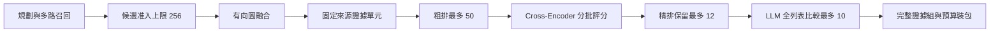

# 圖融合與多階段重排：實作與驗證

日期：2026-09-18。線上搜尋策略：`graph_cascade_v7`。

`search_pipeline.py` 的正常搜尋入口已移除 RRF，改用候選有向圖融合、粗排、提供者 Cross-Encoder 和 LLM 列表排序。既有的規劃、冷記憶／圖／場景召回、至多一次有依據的多跳補查、快照隔離及來源證據包契約保留。

## 實作範圍

| 模組 | 行為 |
|---|---|
| `app/graph_fusion.py` | 向量／詞面先驗、來源重複降權、三元組方向、版本依賴、橋接路徑及有界圖傳播 |
| `app/store.py` | 按使用者及候選索引讀取三元組，先檢查版本、歷史、敏感及撤回等可見性 |
| `app/cross_encoder.py` | 真正的 Rerank API、完整索引映射、原始有限分數、逾時、共享預算及憑證範圍 |
| `app/cascade_rerank.py` | 粗排／精排覆蓋保留、部分故障機會、全列表排序、格式修復與逐階段降級 |
| `app/evidence_packet.py` | 列表順序保留、證據組原子准入、去重不拆组、缺口診斷 |
| `app/budget.py`、`app/metrics.py`、`app/llm.py` | 並發預留、取消後釋放、格式錯誤回應的實際 usage 仍計入預算 |
| `prompts/05c_listwise_rerank.txt` | 回傳完整索引排列、明確無用項與必須共同使用的證據組 |

### 圖融合

以 `0.55 × 向量相似度 + 0.45 × 查詢詞覆蓋` 建立內容先驗，保留最小正質量。同一原始來源的重複候選按來源多重度平方根降權；重複召回路徑不增加票數。

候選准入發生在 metadata 讀取之前。預設圖候選上限 256，規則額外保留；每候選最多讀 8 條三元組、合計最多 512 條。三元組按候選輪流准入，圖最多 4,096 條邊、每次關係擴展最多 8 個鄰居。

只有記錄中的 object → subject 相接才構成關係路徑；版本相符的依賴及召回橋接另有邊類型。反向傳播較弱，共享來源不會產生支持邊。執行 12 次查詢先驗導向的傳播，多跳／敘事或文件／其他查詢的圖混合權重分別為 0.4／0.25／0.1；無有效邊時為 0。

多跳鏈最多保留三個記錄節點，必要橋接来源在排序前納入固定單元。圖邊是可追溯的檢索關聯，不是邏輯蘊涵、因果或權威性的證明。

### 多階段排序與證據組

粗排 50、CE 精排保留 12、LLM 比較 10 均為預設上限，`top_k` 不會擴大模型池。各階段保留有界需求代表；部分 CE 失敗時，保留少量未評分候選給後續 LLM 比較。

Cross-Encoder 使用原始有限 logits，包括負數、零及大於 1 的值。它們只表示該模型的排序訊號，不是機率，也不套用舊版的 0.15 門檻。每個輸入索引必須恰好返回一次。

LLM 一次比較整份列表，回傳：

- `ranking`：所有輸入索引的完整排列。
- `irrelevant`：無用候選；後續不從尾部補回。
- `groups`：互不重疊、每組 2–4 個必須共同使用的候選；預設空列表。

打包先判斷完整組能否准入，再維持原列表的相對順序。後加候選不能因來源去重拆散已接受的組；時間範圍或 stale 過濾使組不完整時，省略整組。`atomic_group_*` 記錄具體損失原因。

CE 不可用時仍可由 LLM 比較有界的圖排序候選；LLM 失敗時保留 CE 順序。兩者均不可用才回退圖先驗，未知分數保持 null，未評分項最多 8 個。無法容納必要來源的單元明確省略，不默默截斷原始引用。

## 部署與設定

本機現有 DashScope 服務已實測支援 `qwen3-rerank`，會自動沿用既有 LLM／embedding 提供者設定。未改動正式 `.env`，既有服務重新啟動後載入新程式與設定。

| 設定 | 預設／用途 |
|---|---|
| `AML_CE_API_URL`、`AML_CE_MODEL`、`AML_CE_API_KEY` | 留空時辨識 DashScope 或 SiliconFlow；其他服務需明確設定 |
| `AML_CE_API_FORMAT` | `cohere` 平面請求；可選 `dashscope` 原生嵌套格式 |
| `AML_CE_BATCH_SIZE`、`AML_RERANK_CONCURRENCY` | 24 條／最多 2 批並行 |
| `AML_CE_TIMEOUT_SECONDS`、`AML_CE_DEADLINE_SECONDS` | 單次 10 秒／CE 階段 12 秒 |
| `AML_CE_MAX_DOCUMENT_BYTES` | 查詢及單元各自最多 4,000 UTF-8 bytes |
| `AML_CE_MAX_REQUEST_BYTES` | 重複 query-document 配對輸入上界 90,000 bytes |
| `AML_CASCADE_COARSE_LIMIT/FINE_LIMIT/LLM_LIMIT` | 50／12／10 |
| `AML_RERANK_MAX_PROMPT_BYTES` | 列表提示詞最多 24,000 UTF-8 bytes |
| `AML_RERANK_REPAIR_MAX_CALLS` | 1；程式最多修復一次格式，0 關閉 |
| `AML_GRAPH_FUSION_ENABLED/MAX_CANDIDATES` | 1／256；停用傳播時使用內容先驗 |
| `AML_SEARCH_DEADLINE_SECONDS/MAX_CALLS/MAX_TOKENS` | 45 秒／12 次／64,000 tokens，沿用共同 Search 上限 |

CE 憑證僅可在相同服務 origin 自動重用；不隨重新導向送出。沒有可用端點、模型或金鑰時明確回報 `RerankUnavailable`，不以普通 chat 模型冒充 Cross-Encoder。`AML_FAKE=1` 的詞匹配僅供離線測試。

CE 呼叫預留其輸入的保守 token 上界；LLM 額外預留 schema、system、訊息框架及輸出額度。成功、失敗及取消均釋放預留。收到但無法解析的模型回應仍計入其回報 usage，格式修復不會漏記第一次成本。

舊 `AML_RERANK_MAX_CANDIDATES`、`AML_RERANK_BATCH_MAX_CANDIDATES`、`AML_RERANK_CALIBRATION_ANCHORS`、`AML_EVIDENCE_MIN_RELEVANCE` 僅供歷史回放。RRF 實作移到 `scripts/legacy_rrf.py`，線上入口不呼叫。回放工具辨識已記錄的級聯排序與固定單元，不重新捏造舊模型批次。

提供者格式依據：[阿里雲 Rerank API](https://www.alibabacloud.com/help/tc/model-studio/text-rerank-api)、[DashScope 相容端點範例](https://help.aliyun.com/en/polardb/polardb-for-postgresql/use-polarsearch-to-build-a-rag-based-solution)、[SiliconFlow Rerank API](https://docs.siliconflow.cn/docs/api/rerank-post)。

## 驗證結果

驗證產物位於 `runs/graph-cascade-20260918/`。正式記憶資料庫及既有記憶日誌未改動；離線測試使用暫存資料庫，真實回歸亦由 `local_eval.py` 建立獨立暫存資料庫。

| 驗證 | 結果 |
|---|---|
| `python scripts/run_selftests.py` | 26/26 套件通過：379 項 unittest，加 16 項 HTTP 契約檢查，合計 **395 項**；exit 0 |
| FastAPI 實例啟動與 `/health` | `selftest_contract.py` 使用 TestClient 實際載入應用，HTTP 契約 16/16 通過 |
| `python -m compileall -q memory_system/app memory_system/scripts` | 通過 |
| `git -c core.safecrlf=false -c core.whitespace=cr-at-eol diff --check` | 通過 |
| 真實 CE 合成煙霧檢查 | 2 文件、1 次呼叫、59 tokens、約 2.18 秒，相關項排前 |
| 真實 LoCoMo 第一場對話、2 題 | 最終 CE／LLM 均 `ok`，`search_degraded=false`；本地 binary judge 2/2 |
| 固定 trace 選擇及裝包回放 | 2 題選中結果不變、packet hash 全部相同、0 次提供者呼叫 |

最終 LoCoMo 兩題分別經過 17 → 12 → 10 個候選，返回 7／10 項；Search 約 8.95／7.02 秒，各 4 次提供者呼叫，分別回報 7,910／7,568 tokens。完整的最終 Add → Search → Answer/Judge 小樣本共 40 次成功呼叫、54,027 tokens。

真實回歸曾發現提供者把整列複製到 `groups`；已補充 schema 欄位描述及明確分組規則，保留嚴格本地校驗。最終結果見 `locomo-final-results.jsonl`、`locomo-final-search.jsonl`；早期降級紀錄保留，沒有覆蓋。

定向回歸另外覆蓋：跨使用者／歷史／敏感圖資料隔離、metadata 准入成本、三元組方向、來源重複降權、罕見選項與多跳橋接、CE 索引錯亂與非有限值、原始 logits、部分失敗機會、硬截止取消、並發預留競爭、無效 JSON 的計費、分組順序及來源去重不拆組。

## 適用界線

這次交付已驗證程式整合、預算、故障處理與現有服務商相容性；没有未處理的已重現阻斷缺陷。

兩題小樣本與受控測試不能證明多跳準確率或整體召回率優於舊版，沒有採用使用者提到的框架百分比作成效承諾。圖先驗及權重是可觀察的啟發式，尚未經業務資料校準；也未新增人工來源權威標籤、邊權時間衰減或重建完整知識圖譜。圖品質不足、候選上限或必要證據超出單元預算仍可能造成漏召回，應透過 `fusion/cascade/coverage` 診斷並以較大業務集評估。

驗證結論：**VERIFIED（本次程式替換、實際啟動與上述測試範圍）**；大規模品質提升仍未驗證。
