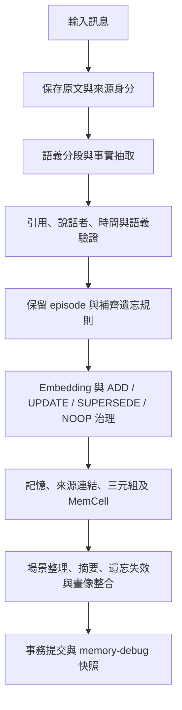
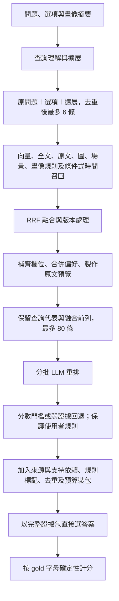
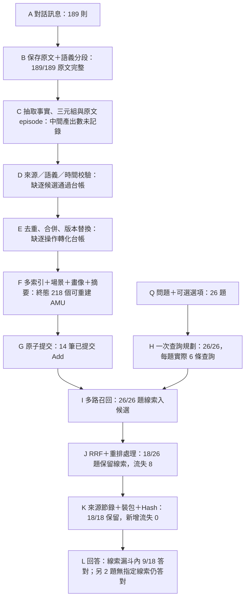

# PersonaMem 32k：記錄—召回流程的證據歸因與階段漏斗

分析日期：2026-09-18。對象：conversation `911d1d0140349ab4dd01`，26 題，**11/26＝42.31%**。
本報告補充[完整統計與 26 題明細](/C:/Users/aapoo/Desktop/aml/memory_system/PERSONAMEM_32K_FUNNEL_ANALYSIS.md)，
重點是定位證據在哪個階段首次失真、在哪裡被補回，以及哪些錯誤目前不能作因果斷言。

## 1. 核心判斷與分析邊界

這次不是單一的「召回不足」。可觀察到的問題有四條鏈：

1. **記錄命題失真 → 查詢或支持鏈被污染。** 把圖片中的狗推成使用者所有物；政治短片偏好引用汽車問題；活動偏好裝包時附帶氣喘支持。
2. **原文仍在 → 候選已召回 → 關鍵句在預覽、候選池或分數選擇中消失。** 分別可見於 Q11、Q10、Q22。
3. **有效原句或約束已入包 → 回答沒有正確使用。** Q3 衝浪、Q16 童年氣喘、Q9 遺忘電音節是最清楚的案例。
4. **標準選項個人前提強於可見來源。** Q5、Q17、Q19、Q20、Q23 不能只用「沒搜到 gold」解釋；來源中的話題提問未必支持傷病、所有權或長期愛好。

新增的關鍵定位是：**Q11 的第三人反證在送入重排前已被節錄器丟失；Q4 的實際擴展查詢帶入了錯誤的養狗前提。**
前一份報告的 15 題「主要歸因」是人工診斷索引，不是互斥的因果分類。不能把各階段出現問題的題數直接相加，
也不能由某階段有問題推定修復後一定答對。

核對範圍：

- 三個實驗檔案的 SHA-256 與前次審查一致；40 個程式／提示詞 hash 均與 trace 記錄一致。
- 資料集展開後的 **189 則訊息逐則、逐字等於保存原文**；不只是數量相同。
- 26 個結果與 Search 的 `search_id`、packet hash 全部對齊。
- 這批 Search 有 104 個成功重排批次，沒有 `rerank_errors` 或降級；平均 11.87 秒。
  先前貼出的 120 秒超時不能用來解釋這批 42.31% 結果。
- Add 日誌是提交後快照，不含每次抽取、語義驗證與治理模型的原始回應。
  能證明錯誤記錄存在，未必能還原是哪次模型判斷首先造成。
- QA 沒有官方來源位置標註；以下正證、反證和約束由人工審查定位，不宣稱是官方 gold evidence。

本次只產出分析與唯讀重核工具，沒有修改執行流程、重新呼叫模型或改寫評測結果。

### 題級四階段漏斗

以下固定追蹤前次人工定位的原文線索，按題計數，並核對其他 AMU 是否補回同一來源。
「記住」表示相關來源保留且連到記憶；「召回」表示至少一個承載該来源的候選被路徑命中；
「入包」要求該來源正文實際可見，僅有來源 ID 不算。這是線索追蹤，不是充分支持 gold 的判定。

| 階段 | 存活題數 | 累計存活率（÷26） | 層間轉化率 | 本層流失 |
|---|---:|---:|---:|---:|
| 26 題起點 | 26 | 100% | — | — |
| ① 記住：相關原文可追溯 | 26 | 100% | 100% | 0 |
| ② 召回：承載線索的記憶入候選 | 26 | 100% | 100% | 0 |
| ③ 入包：指定來源正文可見 | 18 | 69.2% | 69.2% | 8 |
| ④ 線索入包且答對 | 9 | 34.6% | 50.0% | 9 |

**全實驗仍是 11/26＝42.31%，不能以漏斗末端的 9/26 取代。** Q8、Q12 的指定線索未入包卻仍答對，
屬漏斗外的另外 2 題正確答案。未保留指定線索不等於模型無法答對；有線索也不等於個人前提全部成立。

③ 流失 8 題：

| 題號 | 首個可見丟失點 | 結果／解讀 |
|---|---|---|
| Q4 | 烘焙草稿可見，0.1 被篩除 | 答錯；草稿主體支持仍有不確定性 |
| Q5 | 金屬椅子／不適相關來源的候選為 0 或未評分 | 答錯；原文原本就不足以支持 gold 的「舊運動傷引發下背痛」，不能當確證 gold 被丟 |
| Q8 | 明確 Facebook 家庭聯絡來源為 0.1，被篩除 | 仍答對；包內還有 Facebook 等替代話題線索 |
| Q10 | 服裝草稿未進 80 條重排池 | 答錯；最終沒有非規則證據 |
| Q11 | 預覽挑來源時排除 Marcus 第三人反證 | 答錯；後續又接受無支持個人前提 |
| Q12 | Claire 第三人故事可見，0.1 被篩除 | 仍答對；選泛用建議，沒有套用第三人經歷 |
| Q18 | 條件式小花園線索為 0.1，被篩除 | 答錯；gold 的園圃所有權比來源更強 |
| Q22 | 老電影線索為 0.1，被集體篩除 | 答錯；僅留下動漫一般解說 |

③ 是「候選到可見來源」的損失，不能全部稱為 top-50 截斷：本次 top_k=50，但已選條目裝包流失為 0。
在這 8 題中，6 題發生低分篩除、1 題先丟重排預覽、1 題未入重排池；各題仍可能有其他重疊問題。

④ 流失 9 題分兩組：

- Q0、Q3、Q9、Q16、Q21：活動／興趣或明確約束已入包，回答未正確使用；Q0 的活動名稱仍含語義推斷。
- Q17、Q19、Q20、Q23：相關話題線索已入包，但不足以確證美國車偏好、家庭相片展示、稀有黑膠收藏或游泳愛好；不能全部歸責回答模型忽略充分證據。

總錯題數核對：`③ 的 8 題 − 其中答對的 2 題 ＋ ④ 的 9 題 ＝ 15 題`。
①② 的 100% 只說明這組線索仍可追蹤，並不證明記錄忠實率或正式 Recall 為 100%。
逐題布林判定、来源與命中 ID 保存於[題級漏斗資料](/C:/Users/aapoo/Desktop/aml/memory_system/runs/personamem-audit/question_funnel.json)。

## 2. 當前實際流程

### 記錄流程

原文保存、原子命題正確、來源支持正確是三個不同保證。
目前原子抽取有語義驗證，但畫像整合的新命題／強化依賴，以及 NOOP 追加来源，沒有同等的逐命題支持檢查。
因此引用可定位、支持 ID 合法，仍可能產生不受原文支持的個人記憶。

定位：[Add 主流程](/C:/Users/aapoo/Desktop/aml/memory_system/app/add_pipeline.py:507)、
[抽取語義驗證](/C:/Users/aapoo/Desktop/aml/memory_system/app/add_pipeline.py:59)、
[畫像整合](/C:/Users/aapoo/Desktop/aml/memory_system/app/profile.py:139)。

### 召回與回答流程

有三個容易被忽略的細節：

- **候選存在不等於其關鍵句對模型可見。** episode 在重排時用來源節錄取代完整正文；通常只有兩則來源進入預覽，明確 evidence 引用另受保護。
- **重排看到的材料不等於回答看到的材料。** 裝包時可追加支持記憶與其來源；這些新增句子未必接受過相同的相關性評分。
- **`retrieved` 不等於可回答。** 目前只要包非空就可返回該狀態；沒有逐選項的充分性驗證，`verification_status=not_run`、`missing_evidence=[]`。

定位：[查詢理解](/C:/Users/aapoo/Desktop/aml/memory_system/app/search_pipeline.py:76)、
[六條查詢截取](/C:/Users/aapoo/Desktop/aml/memory_system/app/search_pipeline.py:220)、
[候選預覽](/C:/Users/aapoo/Desktop/aml/memory_system/app/search_pipeline.py:380)、
[Search 主流程](/C:/Users/aapoo/Desktop/aml/memory_system/app/search_pipeline.py:742)、
[回答的個人前提規則](/C:/Users/aapoo/Desktop/aml/memory_system/app/eval_scoring.py:86)。

## 3. 漏斗必須追蹤「命題與原句」，不能只數 AMU

分析單位是「選項所需的命題＋主體＋來源原句＋正反方向」，例如：

- Q16：使用者曾有童年輕微氣喘，屬直接自述。
- Q11：學生退學的故事屬 Marcus，屬防止錯誤歸屬的反證。
- Q9：不得使用已遺忘的電音節偏好，屬約束。
- Q18：`If I have a tiny garden` 是條件式園藝提問，不能無條件改寫成「已有蔬菜香草園」。

逐層問七個問題：原文是否支持命題？記憶是否忠實？是否被某路召回？模型預覽是否看得見關鍵句？
是否真正評分並保留？最終包是否仍含該句及人物／否定語境？答案是否符合支持與約束？

同一原句可能有多個 AMU 承載，必須聯集 `equivalent_ids`、episode 與原子記憶；
判定整題丟失前，先檢查其他條目是否補回。`ranked` 也包含未評分尾部，不能把存在於該陣列視為已重排。

### 可量化的數量漏斗

| 階段 | 數量 | 能證明什麼／不能證明什麼 |
|---|---:|---|
| 保存原文 | 189/189 則 | 原文完整；不是 100% 事實抽取率 |
| Add 快照可重建記憶 | 218 個 ID，含 53 episode | 記憶規模；不是 218 個獨立且正確的個人事實 |
| 多路候選 | 9,235 次 | 跨路、跨題重複出現；不能作 Recall 分母 |
| 每題融合後合计 | 4,633 次 | 每題 153–201，平均 178.19；覆蓋範圍很廣 |
| 偏好合併後 | 4,486 次 | 合併 147 次候選出現 |
| 真正重排 | 2,080 次 | 每題 80；2,406 次未評分，不代表它們全無用 |
| 選擇後／裝包後 | 342／342 次 | 此次裝包沒有再因 top_k、bytes、冗餘判定丟失條目 |
| 非規則證據 | 160 次，平均 6.15／題 | 可回答內容很稀疏且分布不均；Q10 為 0 |
| 規則 | 182 次 | 156 次是真正約束；26 次為重複維生素 D 規則 |
| 最終答對 | 11/26 | 任務分數；不等於證據精確率或支持率 |

選擇排除 4,144 次：未評分 2,325、不相關 920、低相關 870、弱回退超額 29。
其餘 81 次未評分候選是受保護規則，仍入包。
全部包平均 7,084 bytes、最大 14,605，低於 32,000 bytes 上限；本次沒有「最終容量不足」的觀察證據。

## 4. 逐階段錯誤及歸因強度

| 階段 | 本次具體證據 | 階段結論與歸因限制 |
|---|---|---|
| L0 可用來源／評測前提 | Q5 下背舊運動傷、Q17 美國車偏好、Q19 家庭相片展示、Q20 收藏稀有黑膠、Q23 游泳愛好，均比可見來源更強 | 來源支持不足或語義距離較大；不能直接判資料集錯，也不能全算記錄漏失 |
| L1 原文保存 | 189 則逐字一致，來源連結可追蹤 | 未觀察到原始訊息丟失 |
| L2 分段與抽取 | 晨間伸展記成潤色郵件；衝浪記成沿海度假；麵包草稿與 Claire 故事混在同單元 | 可辨識活動被摘要弱化，主體與主題邊界混合；部分由原文路徑補救 |
| L3 治理、畫像與支持鏈 | 圖片狗→使用者養狗；政治短片←汽車來源；活動偏好←氣喘支持；重複 preference | 存在命題／來源失配；提交日誌不足以將每個錯配唯一指向抽取、NOOP 或 consolidation |
| L4 查詢規劃 | Q4 實際查詢有 `owns a small calm dog`；Q22 生成動漫與老電影兩條擴展，只使用動漫一條 | 查詢攜帶未支持前提、方向選擇失衡；原問題和四個選項仍使用，不能說老電影完全沒被檢索 |
| L5 多路召回與融合 | Q10、Q11、Q22 的關鍵承載 AMU 均有路徑命中 | 這幾題不能歸咎「向量完全沒搜到」；廣覆蓋仍會帶入大量混合與一般知識 |
| L6 原文預覽 | Q11 的 Marcus 來源被 `source_limit` 排除，episode 只展示 persona 與政治解說 | **確定的評分前反證遺失**；不能說重排模型看到了 Marcus 卻故意忽略 |
| L7 重排池 | Q10 服裝草稿已召回、預覽有 Milan，卻未進 80 條池，尾部 rank 89 | **確定的候選線索丟失**；該草稿是否足以支持 gold 穿搭仍不確定 |
| L8 重排評分 | Q8 明確 Facebook 來源、Q22 老電影原句均可見但只得 0.1；Q18 動漫解說得 0.9 | 存在低估有效線索、高估噪聲；104 批成功只證明調用／格式成功 |
| L9 分數選擇 | 有普通證據 ≥0.5 時，0.1 線索被 0.15 門檻淘汰；低分模式又回填至多 8 條 | 放大分數錯誤；不能孤立地把選擇門檻視為唯一根因 |
| L10 裝包與狀態 | Q9/Q14 活動偏好追加氣喘；Q10 只有規則仍 `retrieved`；維生素 D 重複 | 沒有容量丟失，但存在新增噪聲及可回答狀態不足；包非空不等於充分 |
| L11 回答 | Q3、Q16 正證在包內仍選泛用；Q9 違反已入包約束；Q11 採無支持個人前提 | 可確定答案與包內支持／約束不一致；缺少模型內部依據，不能斷言注意力或偏見機制 |
| L12 計分與監測 | choice 依 gold 字母計分；Q8 答對但最佳来源被丟，Q24 答對但香料架所有權未證實 | 未發現 judge 模型誤判，因這批 choice 沒有 judge LLM；accuracy 掩蓋證據品質差異 |

這些階段錯誤會重疊。Q11 同時包含「反證節錄失敗」和「回答接受無支持前提」；
Q4 同時包含「混合記錄、查詢污染、低分排除與草稿支持不確定性」。只給單一根因會丟掉重要資訊。

## 5. 可逐句重核的證據流向

Q 編號零起算，Search 日誌行數為 Q＋1。`S8:7` 表示 memory-debug 第 9 行 Add 的 `message_index=7`。
表中的「可見」是指定原句可見，並非自動認定它能充分支持標準選項。

| 題目／指定線索 | 原文→連結→路徑 | 重排預覽 | 評分／選擇 | 最終包 | gold→pred／定位 |
|---|---|---|---|---|---|
| Q0 S1:4 晨間墊上伸展 | 全部存在 | 可見 | 0.6，保留 | 原句在 | A→C；摘要弱化已補回，回答未採用；活動名稱仍有推斷 |
| Q3 S8:7 上蠟、逐浪 | 全部存在 | 可見 | 0.6，rank 1 | 原句在 | C→B；下游證據使用失敗 |
| Q4 S5:8 麵團發酵 | 全部存在 | 可見，但混有 Claire | 0.1，淘汰 | 原句不在 | D→C；可見線索在評分／選擇流失，草稿主體仍需確認 |
| Q8 S0:0 Facebook 聯絡家人 | 全部存在 | 可見 | 0.1，淘汰 | 指定原句不在 | D→D；答對不代表沒有召回缺陷 |
| Q9 S3:7 遺忘電音節 | 全部存在 | 可見 | 0.1，規則保護 | 禁用約束在 | A→B；回答違反約束 |
| Q10 S6:5 Milan 服裝草稿 | 全部存在 | 可見 | 未評分，`unscored` | 0 條非規則 | C→A；池前截斷，不是包大小不足 |
| Q11 S0:2 Marcus 學生退學故事 | 全部存在 | **反證不可見** | 承載 episode 得 0.1、淘汰 | 反證不在 | A→D；節錄先丟反證，回答又誤用個人前提 |
| Q13 S6:2 追長篇字幕劇 | 全部存在 | 可見 | 0，淘汰 | 此原句不在，另有動漫興趣 | D→D；直接追劇事實流失；該句單獨不證明是動漫 |
| Q14 S2:12 漫展，原子 event | 全部存在 | 可見 | 0.1，淘汰 | **另一 episode 以 0.9 補回原句** | A→A；不能計為整題證據丟失 |
| Q16 S6:0 童年輕微氣喘 | 全部存在 | 可見 | 0.9，rank 1 | 原句在 | A→C；非敏感過濾或召回失敗 |
| Q18 S4:7 小花園條件式提問 | 全部存在 | 可見 | 0.1，淘汰 | 指定原句不在 | B→C；園藝線索流失，但不確證 gold 的園圃所有權 |
| Q21 S3:19 去中心化資產提問 | 全部存在 | 可見 | 0.6，保留 | 原句及其他相關提問在 | C→B；支持主題興趣的材料未被使用 |
| Q22 S7:3 1940–1950 年代電影 | 全部存在 | 可見 | 0.1，淘汰 | 只剩 1 條非規則：動漫解說 | C→B；明確的評分／選擇損失 |

### 5.1 Q11：重排之前，反證已消失

`amu_b09116da50944b2d` 是混合 episode，連有 S0:0–S0:5。
S0:2 清楚以 `Marcus wrote` 起頭，描述 Marcus 指導的學生退學。
但這條 episode 沒有指定 evidence 引用，`compact_sources(..., 320, 2)` 改以來源與問題的詞項交集挑兩則。

本次純函式重放與 trace 一致：persona S0:0 交集 15、政治解說 S0:4 交集 15、Marcus S0:2 交集 14；
前兩者被選中，Marcus 被標記 `source_limit`。重排用 `_rank_text`，不再用 episode 的完整正文。
因此「記憶連有原文」與「重排模型看到反證」在此分離。

後續 episode 得 0.1 被淘汰，回答包只含一般人生意義內容與規則，卻選了帶有使用者學生退學前提的 D。
可觀察到兩段失敗，不能只修重排門檻，也不能聲稱反證入包就必然改答 A。

定位：[來源選擇排序](/C:/Users/aapoo/Desktop/aml/memory_system/app/personal_evidence.py:23)、
[節錄來源挑選](/C:/Users/aapoo/Desktop/aml/memory_system/app/personal_evidence.py:116)。

### 5.2 Q4／Q22：計畫寫出的查詢，不一定都被使用

Q4 原始養狗來源 S7:7 問的是「照片中的狗，其主人可做什麼」，並未說狗屬於使用者。
記錄卻產生 `The user owns a small dog ...`；Q4 實際第六條查詢也含 `owns a small calm dog`，
並加入教師、堪薩斯籃球等身分資訊，與家庭烘焙的判別線索無直接關係。

錯誤養狗記錄在 23 題融合候選中出現，**沒有進入任何最終包**。
因此「最終重排擋掉錯誤記憶」不能排除查詢階段已有污染。
程式確實會把畫像摘要提供給 planner；日誌沒有保留該次完整 digest，因此不宣稱已證明錯誤短語的唯一生成來源。

Q22 planner 產生兩條擴展：動漫政治／歷史敘事、二十世紀中期電影審查。
原問題加四個選項先占五格，六條總上限只留下第一條動漫擴展，第二條老電影擴展未執行。
不過老電影選項本身仍被檢索，相關原文也已入重排池；**擴展失衡是上游問題，評分／選擇才是這條來源的實際丟失點**。

### 5.3 Q18：高分噪聲會觸發對弱線索的硬淘汰

Q18 的小花園輪作原句可見，只有 0.1；動漫解說卻有 0.9。
四個批次的零起算 index 3 都為 0.9，涉及籃球、漫展／工作 episode、動漫及騎行耐力。
籃球與某個干擾選項有弱關聯，不能把四條一律當成完全無關；但它們不構成小庭院需求的充分支持。

一條普通候選 ≥0.5 就使選擇器啟用 0.15 門檻，因此高分噪聲與低分有效線索相互放大。
這裡能證明分數與判別價值不一致；**不能憑同位置高分就判定索引錯位、位置偏差或服務端 bug**。
需要固定候選、改變排列和分批重放才能區分。

### 5.4 Q3／Q16／Q9：排除上游漏召回後，才能歸因到回答

- Q3 的 `waxing my board`、`still-glass waves` 原句就在唯一非規則證據內，得 0.6、排名第一；仍選泛用 B。
- Q16 的 `Back when I was a kid I had some mild asthma` 原句就在 0.9、排名第一的 profile 中；仍選泛用 C。
- Q9 的電音節遺忘要求帶有 `is_constraint=true` 及 `do NOT use or recommend`；仍選使用該特徵的 B。

26 個 packet hash 一致，回答構造使用完整包，沒有第二次截斷。
這三題不能再歸因於缺少候選或最終包過小。
回答端已寫有「支持時優先個人化、區分第三人、先套用遺忘」的提示，增加同類口號不等於解決模型遵循問題。

## 6. 召回噪聲在哪裡產生

| 噪聲種類 | 進入位置 | 已觀察例子 | 應如何量測 |
|---|---|---|---|
| 命題失真 | 記錄／畫像 | 看圖問主人活動→使用者養狗 | 命題與來源支持的一致率；主體、条件、推論強度分開標註 |
| 支持鏈污染 | 治理／畫像／裝包 | 政治短片引用汽車；活動偏好附氣喘 | 無關支持邊比例、裝包新增支持的正確率 |
| 一般知識替代個人證據 | 抽取／召回／重排 | Q22 最終只留 assistant 動漫敘事解說 | 按選項判別價值標 relevance，不能只看主題相似 |
| 混合來源片段 | 分段／預覽／裝包 | Q11 persona、Marcus、政治解說共享 episode | 條目內有效原句占比；人物歸屬及反證保留率 |
| 查詢偏置 | planner／查詢預算 | Q4 養狗，Q22 只留下動漫擴展 | 實際使用查詢的前提支持率及選項覆蓋，不能只看 plan |
| 重複與治理負擔 | 記錄／裝包 | 每題維生素 D 遺忘重複；8 組完全同文偏好 | 按來源與命題去重後的冗餘比例 |
| 舊描述與當前約束並存 | 遺忘／裝包／回答 | 舊料理包正向描述與遺忘規則同時可見 | 忘記目標的正向描述暴露率、答案約束遵循率 |

182/342＝53.22% 是**規則條目占比，不是噪聲率**；六條有效約束仍有必要。
規則文字約占包 bytes 的 31.49%，此計數未含條目分隔符。
1,935/2,080＝93.03% 是**重排分數 0 或 0.1 的比例，不是真實不相關比例**，因為已找到多個低分有效來源。
目前沒有充分標註可報告全體 precision、noise rate 或官方 Recall@80。

此外，錯記錄未必都傳到答案：政治短片／汽車錯配記憶在 16 題融合出現、音訊／狗錯配在 25 題出現，但均未入包；
活動／氣喘錯配則確實到達 Q9、Q14。這能證明兩次上下文污染，尚不能证明它造成兩題最終答案。

## 7. 修正順序與可檢驗的歸因實驗

| 優先序 | 對應失敗 | 最小對照／驗收 |
|---|---|---|
| P0 | 記錄與支持鏈語義失真 | 對每個新命題、NOOP 追加来源、畫像強化依賴檢查主體與支持；政治短片不能由汽車支持，圖片狗不能成為所有權 |
| P0 | 原文預覽丟反證 | 固定 Q11 候選與模型設定，只換成含 Marcus 主體歸屬的來源片段；分開觀察預覽保留、重排與最終答案 |
| P0 | 重排低估／高估、位置疑點 | Q8/Q18/Q22 固定候選換序、換批；記候選 ID、引用原句與分數映射，檢查跨批穩定性 |
| P0 | 有證據仍誤答／違反约束 | 凍結 Q3/Q16/Q9 原包；用人工最小充分包及逐選項支持檢查作對照，區分包內干擾與回答能力 |
| P1 | 查詢被錯誤畫像帶偏 | 固定記憶，對照無 digest、現行 digest、只用已驗證 digest；記實際六條 queries，觀察證據路徑與池內次序 |
| P1 | 候選池丟獨有線索 | 固定 Q10 召回集，只替換池內代表選法；驗證獨有來源是否入池，不直接把弱草稿當 confirmed preference |
| P1 | 門檻放大不可靠分數 | 先校準評分，再比較按命題保留支持／反證的選擇器；同時量測線索保留與新增噪聲 |
| P1 | 規則重複、包非空誤作充分 | 去重維生素 D 規則、辨識 `forget information about`；分開回報約束數、相關個人證據数與充分性，Q10 應明示缺少服裝支持 |
| P1 | 重排後追加未審材料 | 使重排與最終包的支持來源一致；對新增依賴獨立驗證，禁止活動偏好引用氣喘 |

這些是待執行的對照，**本報告沒有假裝已測得其分數收益**。
最終驗收應加入其他 persona 與未參與調整的題目；只在本次 26 題提高分數可能是過擬合。

建議後續人工證據台帳至少包含：選項前提、使用者／第三人、直接／推論／條件／草稿、正證／反證／約束、source ID 和字元範圍。
以去重原句／命題為單位，分別報告：

1. 原始可支持率，以及記錄命題的忠實率。
2. 各階段在「前階段已存在的必要證據」中保留的比例，另分正證、反證與約束。
3. 預覽與最終包的逐句相關性、重複率、錯誤人物歸屬率。
4. 在已取得充分證據的题目中，答案支持一致率與遺忘約束遵循率。

這樣才能分清「資料本來不足」「記錄失真」「路徑漏召回」「有候選但句子不可見」「篩選淘汰」和「有證據仍答錯」，
而不是把 42.31% 全歸給 embedding 或一個重排閾值。

## 8. 重核產物

- [逐階段流向 JSON](/C:/Users/aapoo/Desktop/aml/memory_system/runs/personamem-audit/evidence_lineage.json)：14 條人工審查鏈，含代表／合併 ID、來源、實際 queries、預覽、真實評分、淘汰原因、跨 AMU 原句補回及錯記錄傳播。
- [唯讀重建程式](/C:/Users/aapoo/Desktop/aml/memory_system/runs/personamem-audit/evidence_lineage.py)：只讀本機日誌，檢查三個輸入 hash、40 個程式 hash、189 則原文及 26 個 packet hash；另重放 Q11 的純節錄函式。
- [全量統計及 26 題台帳](/C:/Users/aapoo/Desktop/aml/memory_system/runs/personamem-audit/audit.json)。

`runs` 產物依專案既有設定不納入 Git；報告保留在 `memory_system`。字串 marker 核對只是驗證人工指定原句能否看見，
不會自動把字詞相似當成支持個人前提，也不代替語義裁決。

## 9. 按指定 A–L 流程圖對齊漏斗

本節沿用題級原文線索台帳，保留指定圖中的節點名稱。記錄端的計量單位是訊息、記憶及提交，
查詢端才改用題數；不能把 189 則訊息到 218 條記憶算成 115% 的轉化率。

### 9.1 節點標註圖

實際程式在重排前也製作一次來源預覽。為對齊此圖，將 `_prepare_candidates` 的預覽歸入 J，
K 則指重排後的最終來源節錄及裝包。因此 Q11 的 `source_limit` 應記在 J，而非 K。
「一次重排」表示一輪流程；本次每題分四批，26 題合計 104 批調用。

### 9.2 A–G：記錄端漏斗

| 節點 | 可觀察的存活／產出 | 已觀察問題與量測邊界 |
|---|---|---|
| A 對話訊息 | 189 則，95 user、94 assistant | 部分 gold 個人前提沒有充分原文支持，不應從 gold 反向補造使用者事實 |
| B 保存原文＋語義分段 | 189/189 原文逐字保存，原文流失 0 | 分段混合人物與主題，例如家庭烘焙＋Claire 故事；保存完整不代表語義單元合理 |
| C 抽取事實、三元組、episode | 中間抽取數未知；提交終態有 53 episode、165 非 episode，152 條三元組 | 晨間活動被摘要成潤色郵件、衝浪被概括成度假；不能用终態 218 計算抽取通過率 |
| D 來源／語義／時間校驗 | 有校驗程式；日誌無每個原始候選的通過／拒絕結果；189 則來源時間皆空 | 最終仍有錯誤所有權與來源錯配；部分內容又在 F 後加，不能將所有錯誤唯一歸給 D；未知時間不是已證實的本次答錯原因 |
| E 去重、合併、版本替換 | 缺逐操作前後台帳；終態有 8 組文字相同偏好 | 文字相同不必然代表可合併，須核對認知狀態和來源；NOOP 追加來源有缺少語義重驗的程式風險，尚非逐案確證 |
| F 多索引＋場景＋畫像＋摘要 | 218/218 可見 AMU 有 256 維向量及全文索引；132 個有三元組，共 152 條 | 索引存在不代表內容正確；畫像與支持鏈有錯配，且可污染規劃或最終支持包 |
| G 原子提交 | 14 筆成功提交記錄，可重建 218 個不同記憶 ID | 日誌只記已提交 Add，無法以 14 筆反推所有 Add 嘗試的成功率；26 題指定來源在提交後皆可追溯 |

記錄端能確定「原文完整」「索引有資料」「錯誤命題／支持仍存在」，
但不能報告不存在的 C→D、D→E、E→F 語義存活率。需要補原始候選 ID、校驗結果、治理操作及來源變更前後資料。

### 9.3 H–L：題級漏斗

| 階段 | 存活題數 | 累計存活率 | 層間轉化率 | 本層流失 |
|---|---:|---:|---:|---:|
| Q 問題起點 | 26 | 100% | — | — |
| H 完成一次規劃 | 26 | 100% | 100% | 0 |
| I 指定線索入候選 | 26 | 100% | 100% | 0 |
| J 重排處理後保留承載線索的候選 | 18 | 69.2% | 69.2% | **8** |
| K 最終包可見指定來源 | 18 | 69.2% | 100% | **0** |
| L 指定線索入包且答對 | 9 | 34.6% | 50% | **9** |

H 的數量流失為 0，仍有查詢品質缺陷：Q4 的實際查詢含未支持的養狗前提，
Q22 只使用第一條動漫擴展，第二條老電影擴展因六條上限未執行。
I 的指定線索覆蓋為 26/26，仍有大量一般知識、混合 episode 及弱關聯候選；這不是全體 gold Recall=100%。

J 的 8 題首個可見損失：

| 子步驟 | 題數 | 題號 | 證據 |
|---|---:|---|---|
| 重排前來源預覽 | 1 | Q11 | Marcus 反證來源被兩則來源上限排除，重排只見 persona 與政治解說 |
| 80 條重排池 | 1 | Q10 | 服裝草稿已召回、預覽有 Milan，但未評分，最終以 unscored 排除 |
| 重排分數與選擇 | 6 | Q4、Q5、Q8、Q12、Q18、Q22 | 承載線索的候選為低分、零分或未評分，沒有替代 AMU 將指定來源補入包 |

這是按人工選定來源追蹤的首次可見丟失，不表示八題都丟了充分 gold 證據；
尤其 Q5 原文並未確證 gold 的下背舊運動傷。Q8、Q12 在這組來源掉出後仍答對。

J 的條目數漏斗是 `融合 4,633 → 合併 4,486 → 實際評分 2,080 → 選中 342`，
均為跨題出現次數；未評分的受保護規則仍可選中，所以不能把這條數量鏈當作嚴格集合包含。
K 為 `342 → 342`，沒有 top_k、bytes 或 redundant_episode 造成的新增條目淘汰。
但 K 仍有支持鏈追加噪聲、重複規則及僅有規則仍標 retrieved 等品質問題。

L 的 9 題流失：Q0、Q3、Q9、Q16、Q21 的活動／興趣／約束未被正確使用；
Q17、Q19、Q20、Q23 則只有較弱話題來源，不能確證 gold 的更強個人前提。
全實驗仍有 11 題答對：漏斗內 9 題，加上 Q8、Q12 兩題。`(8−2)+9=15` 題答錯。

新增重核資料：[A–L 節點漏斗 JSON](/C:/Users/aapoo/Desktop/aml/memory_system/runs/personamem-audit/node_funnel.json)，
直接檢查路徑／融合候選、J 選中 ID、K 實際可見來源及最終答案，並保存索引結構統計。
